<!-- TOC -->

- [CSAPP概述](#csapp概述)
- [1. 数据的表示](#1-数据的表示)
  - [1. int 和 unsigned int](#1-int-和-unsigned-int)
  - [2. float](#2-float)
  - [3. bytes order](#3-bytes-order)
- [2.程序的机器表示](#2程序的机器表示)
  - [1. Basics](#1-basics)
  - [2. Control](#2-control)
    - [1. 条件执行](#1-条件执行)
    - [2. 条件分支操作](#2-条件分支操作)
    - [3. 循环](#3-循环)
    - [4. switch 操作](#4-switch-操作)
  - [3. 过程](#3-过程)
    - [1. 堆栈结构](#1-堆栈结构)
    - [2. 函数调用](#2-函数调用)
    - [3. 递归](#3-递归)
  - [4. 数组和结构体](#4-数组和结构体)
    - [1. 数组](#1-数组)
    - [2. 结构体](#2-结构体)
    - [3. float](#3-float)
  - [5. 汇编进阶](#5-汇编进阶)
    - [1. 内存分布](#1-内存分布)
    - [2. 缓冲区溢出](#2-缓冲区溢出)
    - [3. Union](#3-union)
- [3. 程序优化](#3-程序优化)
- [4. 内存层次结构](#4-内存层次结构)
  - [1. cache 储存器](#1-cache-储存器)
- [5. 链接](#5-链接)
  - [1. 符号解析](#1-符号解析)
  - [2. 重定向](#2-重定向)
  - [3. 可执行文件](#3-可执行文件)
  - [4. 库文件](#4-库文件)
    - [1. 静态库](#1-静态库)
    - [2. 动态库](#2-动态库)

<!-- /TOC -->
# CSAPP概述
太多lab了，后面挑自己不是很理解的部分做做lab吧。

# 1. 数据的表示

## 1. int 和 unsigned int
everything is bits，0 or 1。主要方便存储。一般二进制中的小数点含义类似于十进制：右边第一位代表2^-1,第二位代表2^-2。1字节=8 bits，通常4个比特位用一个16进制的0-F来表示。因此一个字节就是两个16进制数。可以进行训练，2进制和16进制之间的转换，记住几个主要的表示即可。
| 16进制| 2进制 |
| :------------ | :------------: |
| F     |  1111 | 
| A      | 1010 |
| C      | 1100 |  
位之间存在位运算（假设1为真，0为假）： &（and）、|（or）、not（~）Exclusive-Or（^,相同为0，不同为1，感觉只要记住 1 0为1，其他为0就行，不用关注相不相同，或者理解成相加）。
>位运算的用处：
>1. 表示集合；假如01101001，可以表示为{0，3，5，6}(这些位从右往左数起，位上为1，所以8位可以表示0-7的数)，这样节省空间。并且这种情况下：&类似于交集，|类似于并集，^类似于对称差异（两者不同时有的），~类似于补集。  
>2. 区分于逻辑运算： && || !，逻辑运算中，0为false，1为true。所以 !0x41 = 0x00。另外，如果想确保p是否为空指针可以用 `P && *P `,前面看是否是空指针，后面看是否指向有效值，另外逻辑运算存在 **短路效应**,例如 A||B，如果 A为真，就不会去评估B了，因为B无论是啥结果都是真。  
>3. 移位运算符：通常分为左移和右移，并且分为逻辑移动和算术移动。一般左移只有逻辑左移，就正常右端补0。右移分为逻辑右移和算术右移：逻辑右移同上，算术右移补的不一定是0，最高位是0就补0，最高位是1就补1。算术右移主要用于有符号整数。  
另外一个w位的数据类型移动 k>=w 位时，会取模 k=k%w，避免数据丢失。  

无符号整型的2进制转10进制比较简单，就是直接2的幂加权即可。有符号整数转换公式如下(**补码也等于源码取反+1)**：  
$$ B2T(x) = \sum_{i=0}^{w-2}x_i*2^i-{x_{w-1}*2^{w-1}} $$
>理解如下：后w-2位正常加权，然后减去第一位*2的幂（所以如果第一位是1就是负数，是0就是正数）。 如`10110 = -16+4+2 = -10 `  

计算机内通常采用补码表示数字，假如源码表示是 x ,那么取反+1就是
$$ 2^n-1-x+1 = 2^{n-1}-x $$
也就是实际补码表示的大小。所以有符号整型中最大值是2^(w-1)-1,最小值是-2^(w-1),正数表示的比负数少1（绝对值来看）特殊情况：所有位为1等于-1.
```
int number = -1;
int number1 = 7;
std::bitset<4> binaryRepresentation(number);
std::cout << binaryRepresentation << std::endl; // 1110
std::bitset<4> binaryRepresentation1(number1);
std::cout << binaryRepresentation1 << std::endl; // 0111
```
可以通过bitset容器打印出其二进制表示。
在一个不等式中，unsigned 和 signed比较，会自动进行类型转换，都转成unsigned进行比较，会**+/- 2^w（U2T or T2U）**。如果两个类型相同，那就不需要进行转换了。这里有个需要注意的地方：
```
// 这样会报错，因为unsigned会一直大于0，下面溢出后，会直接回绕成2^32 -1,然后就会访问未定义的内存，触发未定义行为
int main(){
    int a[5]={1,1,1,1,1};
    for( unsigned int i=4;i>=0;i--){
        cout<<a[i]<<endl;
    }
    return 0;
}

// 那如果将循环改成这个呢，同样报错，因为sizeof()返回unsigned，然后int也会转为unsigned。
for(int i=4;i-sizeof(char)>=0;i--)
```
实际使用中，还会用到signed Extension（例如一个8位的有符号整型要变成32位的有符号整型），如果是正数（前面补24位0即可），如果是负数就在前面补24位1即可。这可以解释一下算术右移前面补1的情况。证明如下（假设从m位扩充到n位）：
$$ X_{ago} = a - 2^{m-1}, X_{now} = X_{ago}+2^{m}+2^m*{(2^{n-m-1}-1)-2^{n-1} = X_{ago} }$$
那如果是 Truncating(截断，例5位变4位，unsigned类型)，直接取mod。例如 11011（27）变成 1011（11）直接 27%16=11。16为2的4次方（截断之后的位数）。如果是signed类型貌似没啥规律。  
数字的运算有加减乘除：
1. unsigned加时，溢出情况会直接丢弃溢出位（就是前面说的取模），signed相加也会有类似情况，例如 1101（-3）+0101（5） =0010（截断了，2），符合预期，如果溢出会导致 +2^w(负溢出) 或者-2^w(正溢出)，理解为回绕也ok。
2. 减法，可以转换为加法。**-5取反+1就得到5，5取反+1就得到-5，牢记！！！**。
3. 乘法:w位与w位相乘得到2w位，需要截断成w位，mod 2^w(unsigned),若为signed,先把x y 理解成无符号，然后mod 2^w,再unsigned 转 signed。例如 2（0010）*（-3）（1101）= 1010（10）然后U2T（-16）=-6。因为有符号相乘和无符号相乘最后保留的几位都是相同的。如果是乘以 2^w,就左移 w位。
4. 除法：除以2的幂，就右移，得到是商，正负都是向下取。例如0110（6）/4 =(0001)(1),补码1010（-6）/4 = 1110（-2）。都是向下取整，补码是算术右移，前面补1。但是负数向下取整(正常-6/4=-1)不符合人们直觉，所以一般会选择偏置，然后达到一体化（“向0舍入”）。偏置怎么偏，例如 -6/4 = (-6+3)/4 （这里向下取整） = -1，右移k位，就偏置(2^k -1),也就是 [x/y] = [(x+y-1)/y]。  

## 2. float 
浮点数的储存更为复杂，参考十进制的小数点，小数点后面1位就是 2^-1，依次类推。但是这样表示不是太精确，并且取值范围有限（浮点数就是说小数点在浮动）。最后引出了个标准化表示，类似于科学计数法。  
$$ (-1)^s *M*2^E$$ 
s为符号位，M为二进制小数，通常 1~2，后面E就是指数。通常有单精度（float，32位 1 8 23）和双精度（double，64位， 1 11 52），分别代表符号位 指数 小数（指数就是8位和11位，也叫做阶码）
1. 规格化，exp的位不为0，也不全为1.此时阶码的值为
   $$ E=e-Bias, bias = 2^{k-1}-1, k为阶码位数,e为表示的unsigned $$
   所以单精度就是 -126~127 双精度就是 -1022~1023；加偏置的原因是方便比大小。尾数就直接表示0~1的小数（代表小数点右边所有数字），然后默认+1，就能表示1~2了。
2. 非规格化：exp全为0。
    $$ E = 1 - bias $$
    尾数M = f，不包含隐藏的1。这是为了方便表示那些接近0的数。此时 E = -126（单精度），尾数就是实际数字。
3. 特殊值:exp全为1，f =0000..，代表无穷大，根据前面符号确定是正无穷还是负无穷；如果 f不全为0，代表NaN。
4. 这里举例 符号位1位，exp 4位，小数 3位。那么最小的规格化数（以正数为例）是 00001000，就是 1*2^-6 = 8/512。最大的非规格化数是 0000111，是 7/8 * 2^-6 = 7/512。 这样就让数字平稳过渡了。这也解释了**为什么非规格数要写成 1-bias，M = f**。
5. 由于表示方法限制了浮点数范围和精度，所以需要舍入来找近似值表达。但是浮点数需要计算，如果舍入不合理，舍入误差会不断积累，造成较大误差，所以采用**四舍六入五偶（减小误差）**，补充一下十进制小数转2进制采用 乘2取整法。
6. 浮点数乘法：s=s1^s2（异或），M= M1*M2， E=E1+E2。 M需要移位到1~2，E溢出就直接变为无穷。浮点数加法对齐到指数高的那一个，然后通过移位确定小数。如 1.01 * 2^10 + 2.01 * 2^17， 需要对齐到 17，然后1.01 转为2进制再移位。 ps： 如果一个很小的浮点数加减一个很大的浮点数，有可能小数直接就被略掉了，因为在很后面，然后截断。例如 3.14+1e10-1e10=0，3.14+(1e10-1e10)=3.14，所以在进行浮点数之间相加减和相乘除时需要注意结合。
7. int float 和 double之间的转换：int转float，可能会被舍入。int float转double比较精确，float和double转int可能会溢出，会直接把小数截断,例 (int)(1.8)=1。

## 3. bytes order
补充一下，字节在内存中以什么样的顺序存储：小端序（为主，低地址存低字节）和大端序（网络传输多用）。例如 0x1234,0x34是低字节就存在低位，大端序跟人眼看到的一样，0x1234,0x12为低地址。测试如下：
```
// 可以判断是大端序还是小端序，让num=1，看输出是否01,是就是小端序，反之就是大端序。
typedef unsigned char * byte_pointer;  // 用指针数组
void show_bytes(byte_pointer start, size_t len){
    size_t i;
    for(i = 0; i < len; i++){
        printf("%.2x\n", start[i]);
    }
    printf("\n");
}
int main(){
    int number = 15213;
    show_bytes((byte_pointer) &number, sizeof(int)); // 6d 3b 00 00
    return 0;
}
// 计算 15123 = 3* 16^3 + 11*16^2 + 6*16 +13, 所以表示应该是 3b6d,所以是小端序。
```
# 2.程序的机器表示

## 1. Basics
教读汇编，主要教学x86下的，也被称作8086。两种指令集 CISC （complex） 和 RISC（reduced）。CISC过渡到RISC。一般x86是CISC，Arm是RISC（常用于移动端）
>举例说明： MOV AX, [BX+SI]  ; 将BX+SI指向的内存地址的内容移动到AX寄存器，但是Arm底下的RISC：
LW R1, 0(R2)  ; 从R2寄存器的基址0加载一个字到R1寄存器，通常只有一个基本操作。一个字通常指的是计算机一次能够处理或传输的数据量。这个概念与计算机的字长（word size）紧密相关，例如，一个32位计算机的“一个字”就是32位，或者说4个字节。

汇编中一些对程序员隐藏的处理器状态，但是汇编中可见的：
1. 程序计数器（PC，x86-64中用%rip表示）：给出将要执行的下一条指令在内容中的地址。
2. 寄存器文件：可以储存很多东西。还有一些状态寄存器（16个整数寄存器）

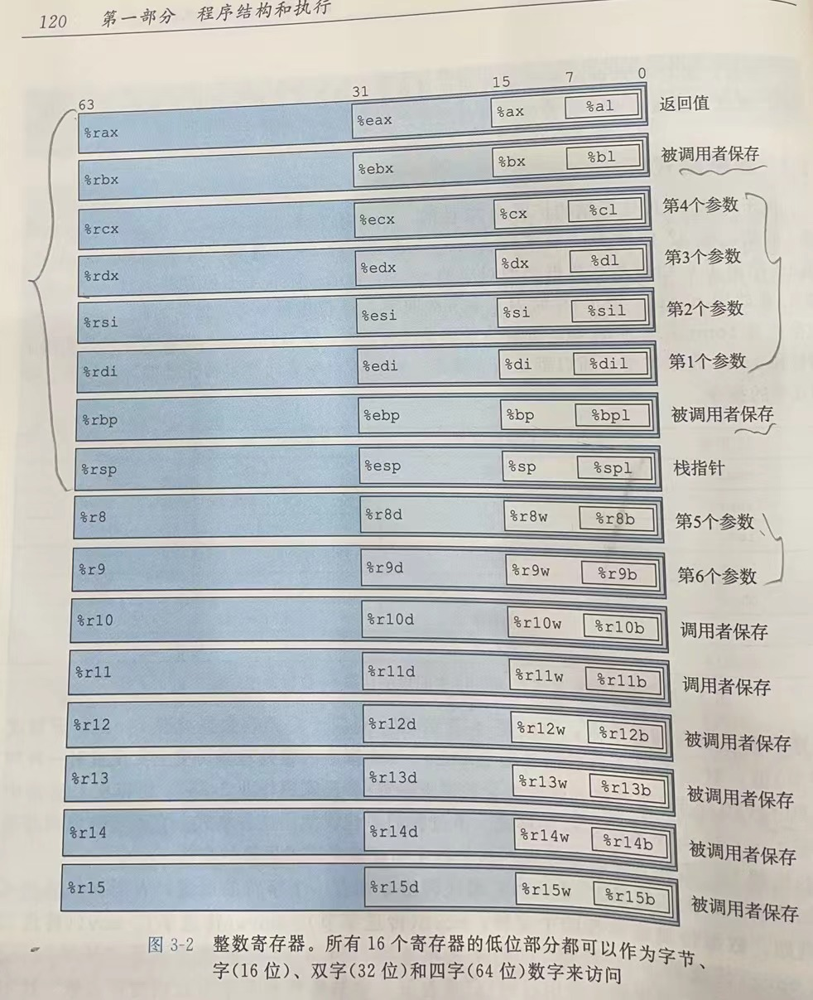  


内存可以看作一个字节数组，虚拟内存看起来像是独立的字节数组，但是在物理上却是共享的。编译过程分为预处理 编译（生成汇编代码） 汇编（binnary） 链接（binary）。编译命令：`gcc -Og -S filename ` 将filename 编译成汇编代码，-Og 代表优化编译后的结果。同时也可以用 objdump 反汇编 可执行文件，得到是一些指令与其对应的字节(`objdump -d xxx> xxx.txt`,代表重定向到txt文件)。也可以用gdb，先`gdb file`，然后 `disassemble your_func` (反汇编你的函数，注意不是程序，前面的file是程序)。

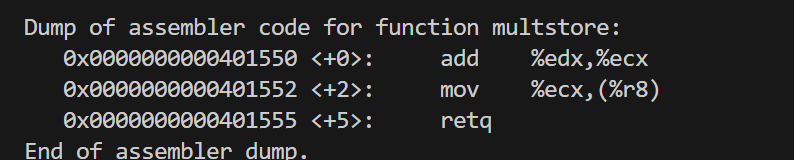  

>1. 还有个常用的栈指针寄存器 %rsp（stack pointer），可以稍微记一下。%exx 是代表 32位寄存器，%rxx代表64位寄存器（在不断优化）。  
>2. 针对moving data的操作数，存在3种类型：（1）立即数，就是常数值（2）寄存器，用ra,ra代表寄存器名字（3）也可以用地址或者（ra）表示ra寄存器里面存储的内存地址。 所以可以有三种表示：movq $0x400, %rax 和 movq %rax, %rbx 和 movq %rax, (%rdx)。另外补充一下内存引用语法是 Imm(rb,ri,s),操作数值就是 Memory [Imm（偏移量） + R[rb]（基地址） + R[ri]*s（比例因子，为 1,2,4,8）]。R代表寄存器数组，rb，ri寄存器就类似索引，来得到寄存器内容。 ps： movq不能直接从内存**复制**到内存，且movq 是从第一个复制到第二个 注意！！！  且 movq默认移8bytes，movl移4bytes。
>3. leaq: 类似于&，将值写入目标操作数。第一个操作数像内存引用 范式。例如 rdx寄存器存着x值，rsx存着y值，那么 leaq 7(%rdx,%rsx,4), %rax ,就是把7+x+4y copy到 rax。

另外汇编代码格式也存在 ATT 和 Intel。常用的gcc就是 ATT format的
> 1. ATT是 source 前 ，destination在后； Intel相反
> 2. ATT 是()寻址，Intel是[]寻址，还有指令名称存在差异，如 movq（ATT） 和 mov（Intel）
> 3. 还有很多常用指令有空再翻书看把...

## 2. Control
前面主要讲指令的顺序执行，但是对于某些条件语句，循环语句都是有条件的执行。这里主要讲怎么实现条件执行。然后描述 循环 和 switch 的实现。ps：jump 可以指定跳到程序的某些地方。

### 1. 条件执行
条件码：一些标志位，条件指令执行的基础。CPU维护者一组单个位的条件码寄存器。所有的算术和逻辑操作都会设置条件码。
1. CF(carry flag):最高位进位标志，产生额外的位。用来看 unsigned 溢出
2. SF(sign Flag) 符号标志，最近的操作得出的结果为负数就置为1
3. OF(over Flag) for signed，最近操作溢出
4. ZF(zero Flag) 最近操作为0

条件码设置可以通过以下：
1. Compare： cmpq b,a 类似于计算a-b（参数顺序倒了），然后condition code 根据 a-b 大小来设置。一般有两个数就用 cmpq。ps：参数列出顺序跟形参相反，所以后面比大小就根据形参位置来就行。
2. Test：testq b,a 类似于计算a&b。通常可以跟一个掩码操作。 ZF 1 when a&b=0,SF 1 when a&b<0。可以理解为compare 和 test 之后，条件码自己会变。
3. set：根据条件码的组合设置一个字节为0/1。目标操作数通常是一个字节寄存器或者一个字节内存。所以如果要变成32位/64位，高位清0。（这里一个字节寄存器代表寄存器的低位，高位的7个字节不变，寄存器可以翻阅csapp中文版120页）。所以通常情况如下：
```
setg %al // al为rax的低位一字节
movzbl %al, %eax // zero rest of rax, movzbl就是扩展宽字节的意思，前面补0
ret
// 为什么是eax，那怎么确保前面32位呢？这是amd的默认的，对四字节的操作默认会把前面四个字节置为0
```

### 2. 条件分支操作
主要通过 jX 指令去跳转。例如 jmp(但是这个是随意跳转，jmp也有间接跳转：jmp *%rax,用rax内的值作为跳转目标。jmp *(%rax):读rax中存的地址指向的值为跳转目标)，我们主要关注的就是根据状态码去跳转，用jX，这种跳转是直接跳转。举例说明：jle（le代表 lower and equal,就是≤）。代码示例：
```
// 源码
long absdiff(long x,long y){
    long resule;
    if(x>y) result = x-y;
    else: result = y-x;
    return result;
}
// 汇编
absdiff:
    cmpq %rsi,%rdi   // rdi:x rsi:y,前面说过的与形参顺序相反
    jle .L4
    movq %rdi, %rax // rax:x
    subq %rsi % rax  // rax:x-y
    ret
.L4：
    movq % rsi %rax
    subq %rdi %rax  
    ret
// 这里为什么要用 rax,翻阅前面寄存器作用可以看到，rax常用作返回值
```
C中的 goto语句有点像 jmp。所以一般普通的if else 语句可以直接用C的goto Version来代替汇编的阅读，后面都这么用。

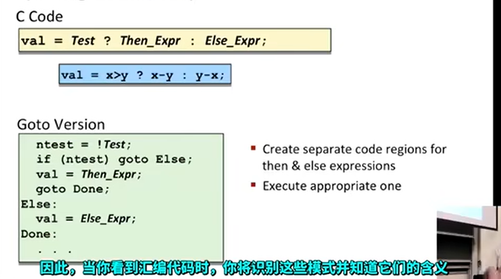  

传统条件操作是用上述的控制条件转移，但实际上在现代处理器上，使用 **数据的条件转移** 更高效。
主要是因为现代处理器都是使用重叠连续指令的方式来获得高性能。而分支预测错误可能导致指令要重新取。所以用数据条件转移更好，如下：**先把两种条件下的值都算出来**，但是这种不一定能够转换过来，需要两个计算简单都安全。GCC默认数据的条件转移。

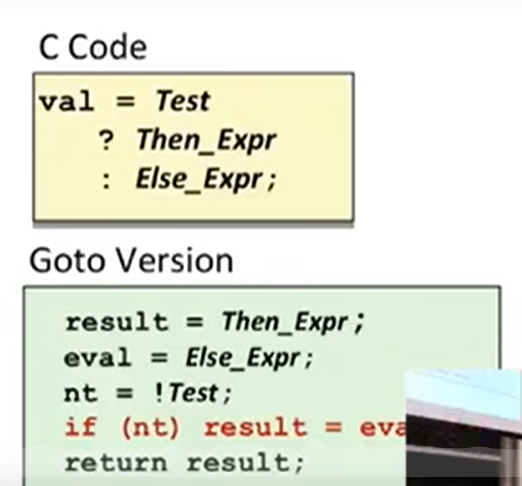  

### 3. 循环
循环也属于控制结构的一环。有 for循环 while循环，do-while循环（最不常见）。
1. do-while
```
// do-while示例
do:
    state
    while(test-expr)
// goto 版本
loop:
    state
    if(test-expr) goto loop
```
while 跟 do-while差不多
```
while(test-expr){
    state;
}

// goto 版本
    go to test;
loop:
    state
test:
    if(test-expr) goto loop
```
**跳到中间来，然后顺序执行**。针对两个还有个通用版本（guarded-do策略），先把while转为do-while，然后写。

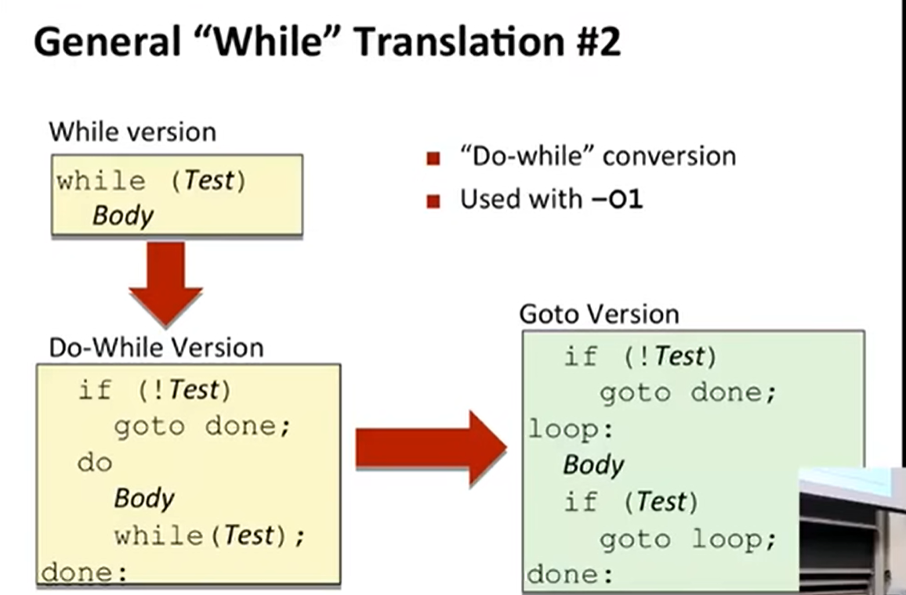 

2. for循环（用的很多）
`for(Init,Test,Update) Body;` 是for循环基本结构。可以直接转为while循环。
```
Init;
while(Test){
    Body;
    Update;
}
```
### 4. switch 操作
switch跟前面不太一样，有很多个判断语句（switch-case，要通过break跳出。存在以下情况：
1. 分支比较多
2. 分支没有break的话，会跳到下一分支
3. 分支也有可能 do-nothing

使用跳表机制，跳表机制就是把所有的case下的body都放入一个表中，按照索引区分。Jtab里面存的是地址，地址指向的是代码块。

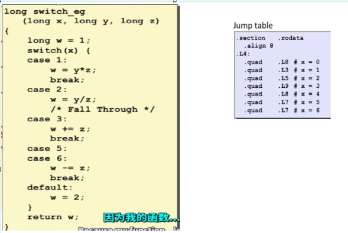 

核心在于 goto *JTab[x] 跳转到地址指向的代码块。

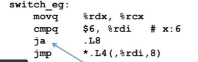 
汇编代码需要注意的地方：

1. 先拿rdi与6 对比，看有没有 >6,大于就跳到 .L8,就是 default模块。这里用的是 ja（unsigned >），为什么不用jg（signed >）。因为如果是负数转为unsigned 就会溢出成很大的正数。同样是大于。符合要求。 但是如果本身就有负数呢？ 编译器会自己进行偏置，最后偏置成最小值是0.
2. 跳转 *.L4(,%rdi,8) L4是基地址，就是跳转 L4+ rdi *8 地址指向的代码块（每个代码块是8个字节）这是间接寻址
3. case2 和 case3 分别是 L5 L9. case3 w的来源有两个，一个是case2，一个是初始化，所以需要给w初始化。同时为什么最开始w不进行初始化：因为编译器发现初始化之后后面可能会重新赋值。比如 w = y * z，所以编译器先不这样做。
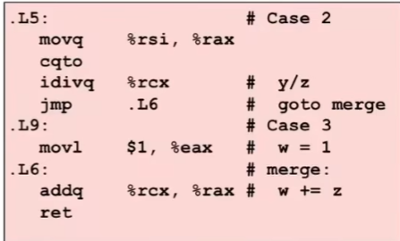 

值得思考的地方：
1. 如果只有case 0，和 case 10000，中间的值不会全部建表。而是会变成 if else 类似的汇编。
2. case的值存在负数，且较为稀疏。那么会进行偏置且转为 if else 代码，或者二分搜索法建立条件树，具体看编译器怎么优化。这也是为什么switch的值要为常数，这样才可以先确定范围，然后去优化跳转条件之类的（个人理解）

## 3. 过程
ABI：应用程序二进制接口，应用程序和操作系统的底层细节。

### 1. 堆栈结构
程序用栈来管理过程调用与返回的状态，栈指针 %rsp（只是存放栈的最低地址，而不是栈的一部分）。先给出栈的最重要性质。
1. 向低地址生长，因此top元素在最低地址。所以栈空间增长通过： rsp--。同时，我们画栈约定倒着画！主要操作就是push pop，在汇编层面就是pushq popq，另外pushq 是将寄存器值入栈，popq是将栈中值存到寄存器。
2. 使用 pushq popq 指令时，不需要显式地减少 rsp 的值，指令会自动处理这一部分。


### 2. 函数调用
函数调用控制主要通过 call（调用函数） ret（返回）。函数调用会不断有栈帧入栈。例如yoo函数调用who函数，who函数调用ami函数，ami函数不断递归。

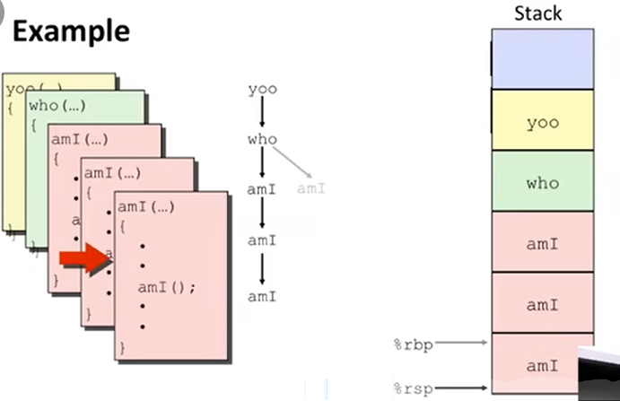 

rsp为栈指针， rbp为基指针，两者控制了一个栈帧（rbp在汇编中通常不可见，由硬件控制）。正常函数调用返回的过程如下。

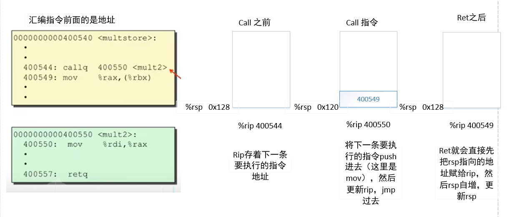 

所以实际call就是push+jmp，ret就是pop(还有更新rip)。  
参数传递，如果参数≤6时就用寄存器保存，如果参数比较多就用自己的栈帧保存参数。这里补充一下：
1. 返回地址入栈是指：当前执行的下一条指令的地址（即函数调用之后的指令地址）被压入栈中，这样当函数执行完毕后，程序就知道返回到哪个位置继续执行。
2. 假如有8个参数，入栈的是8st 7st 参数，入栈顺序从右往左。
3. 编译器怎么知道释放多大的栈帧：编译器事先会计算好xx函数需要的栈帧大小，然后释放时候就知道了。

假如有两个函数 yoo 调用 who。you 函数中给，rdi寄存器设置了值，然后who函数也会改变rdi寄存器的值，这就会导致寄存器的值发生变化。所以有两种解决方法：（1）调用者保存：在调用函数之前，将局部变量的值保存在栈帧去（2）被调用者保存：被调用者操作寄存器时，先把寄存器里面的值存到栈中再操作，然后返回时恢复之前的状态。这也是两种寄存器类型：调用者保存寄存器（需要自己写汇编操作） 和 被调用者保存寄存器（不要自己操作）。

### 3. 递归
举例说明：

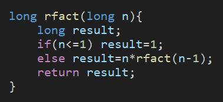 

汇编代码逐行解析：
```
// rdi寄存器存着参数，递归中需要保存的值就是那个参数n，递归有push 就有 pop
rfact:
    pushq %rbx         // 用rbx保存那些可能被覆盖的值
    movq %rdi,%rbx     // 将参数n存到 rbx
    movl $1,%eax       // 先设置返回值为1,用eax，则高32位会自动置为0
    cmpq $1,%rdi       // if n<=1 直接popq rbx，返回的还是rax 1
    jle .L35
    leaq -1(%rdi),%rdi //  将rdi寄存器值-1 n-1
    call rfact  
    imulq %rbx,%rax  // 与 更新后的rbx值相乘 
.L35:
    popq %rbx  // 从栈中弹出一个值到 rbx里面  
    ret
```
## 4. 数组和结构体
之前讲的都是基本数据类型，现在讲数组和结构体。

### 1. 数组
内存引用指令来简化数组访问：例如E是一个int数组，想计算E[i]。（ps：数组名也是一个地址）
| 寄存器| 值|
| ------| ---|
|%rdx | E的地址|
|%rcx|  i|

则 movl (%rdx,%rcx,4) %eax 就可以将对应的值放到 eax中去了。 （这里也解释为什么因子需要是 1 2 4 8 基本涵盖了所有的数据类型；movl代表就进行低32位操作）。  
多维数组也是类似，一行行按顺序。假如int A[3][3]。 那么A[0][2]对应的地址+4 就是 A[1][0]了。
address：A[i][j] = A + i*(C*K)+j*K K为元素大小。汇编代码如下。
```
// 根据 index dig 求元素
leaq (%rdi,%rdi,4), %rax  // 5*index
addl %rax,%rsi    // 5*index + dig
movl pgh(,%rsi,4), %eax  // 加上 pgh 
```
定长数组比较容易确定，那么变长数组呢？变长数组就多加个寄存器存参数，一样的计算。
### 2. 结构体
struct 和 union。
struct的所有部分都存放于一段连续的区域。编译时就可以直接知道大小。所以也简单，都是通过偏移就可以得到。如下。

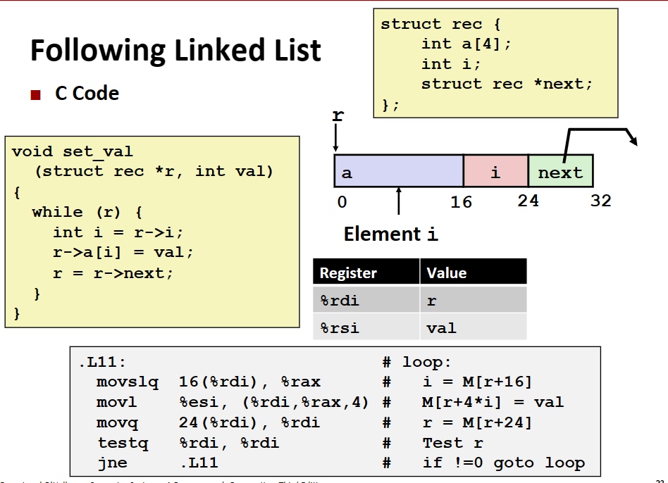 

当然上面的是理想情况，实际上，编译器通常会进行字节对齐。便于提高访问速度。所以通常可以改动struct变量的声明顺序来节省空间。如 char int char 12字节 int char char就是8字节。
union是结构体。一次只能访问里面的一个数据。

### 3. float
使用 xmm 寄存器进行运算，并且是 调用者保存 寄存器。参数是%xmm0，%xmm1....返回值是 %xmm0。
但是不能在 xmm寄存器和 普通寄存器中进行数据交换。只能用内存引用。例如 `movsd (%rdi) %xmm0`

## 5. 汇编进阶
### 1. 内存分布
内存分为栈 堆 数据段（全局变量和静态变量等） 文本段（只读，包含机器代码），一般stack的大小控制在8MB，可以通过指令（limit）查看。
### 2. 缓冲区溢出
例如数组下标溢出。通常字符串函数容易出现此问题，因为无法指定要读取的字符数限制。所以有时候可以用代码注入来使得函数返回位置不是之前的，而是由黑客控制的...  
怎么避免？
1. 用函数确定字符数目，超出就截断
2. 栈随机化，每次程序运行，运行位置都是随机的
3. 栈保护：缓存区与栈状态之间储存一个值，看值有没有变化，就知道有没有溢出
4. 将栈标记为不可执行的

衍生出新的attack方式，针对2，使用gadget。
1. 寻找Gadgets：攻击者寻找程序内存中以ret（return）指令结束的代码片段，这些片段通常执行一些有用的操作，如将参数从栈中弹出到寄存器中，或者将某个值赋给寄存器。
2. 构造ROP链：攻击者构造一个“链”，其中每个gadget执行完毕后，通过其ret指令返回到下一个gadget的地址。这样，通过精心设计的栈布局，攻击者可以控制程序的执行流程。
### 3. Union
跟struct很像。但是联合体只会占用空间最大的域的大小来分配内存。只能使用多个元素之间的一个值。举例说明：
```
union{
    float f;
    unsigned u;
}
```
上面的值跟类型转换得到的完全不一样，因为类型转换会改变其位，而union不改变其位。union还可以用来判断机器的大小端：
```
int main(){
    union{
        char c;
        int i;
    } u;
    u.i = 0x12345678;
    printf("%x\n", u.c);   // 0x78 就是小端 0x12就是大端
    return 0;
}
```
# 3. 程序优化
首先就是要去掉程序中没有必要的代码...(针对于高级编程语言而言，一般不会自己写汇编，汇编是编译器做的事情)
1. 针对数组访问，就是要避免重复计算，乘法尽量转为加法（但是优化程度有限）
2. 循环内的重复计算可以提到循环外。例如 `i< strlen(s)`, strlen(s) 可以提到循环外，`int n = strlen(s),i<n`
3. 指令并行:依赖系统，适用于各种机器。同时读取多个指令，判断指令之间的依赖，然后并行执行。

计算机的流水线设计是一种用于提高计算机处理速度的技术，它允许多个指令同时处于不同的执行阶段。就是把一个指令分成几阶段，每个时钟周期同时完成多个指令的某些阶段。除法貌似没有pipeline，所以除法耗时很长。所以尽量让没有依赖的项先计算。还有向量化可以优化计算（这个没懂，先留个坑）  
针对于前面的分支预测，寄存器有多个虚拟寄存器，会先尝试计算，把值放到虚拟寄存器来，最后更新到实际寄存器中。

# 4. 内存层次结构
内存是个大的字节数组。多个RAM组成主存，RAM分为SRAM（用作Cache）和DRAM（用作主存），基本单位是存储单元，每个存储单元储存一个bit。RAM是易失性（所以断电了主存需要重新加载），ROM是非易失性。  
还有系统总线（bus），机械硬盘就是一堆磁头，固态硬盘没有机械部件，都是由闪存构建，所以有擦除上限。

同时提高cpu速度但是不提高存储器速度，机器性能不会怎么变化，所以引入程序的局部性：程序倾向于使用其地址接近或等于最近使用过的数据和指令的那些数据和地址，有空间局部性和时间局部性。好的程序员应该在代码中尽量加强这种局部性。举例说明：
```
int sum_array_rows(int a[M][N]){
    int i,j,sum=0;
    for(i=0;i<M;i++){
        for(j=0;j<N;j++){
            sum+=a[i][j];
        }
    }
    return sum;
}
```
这个代码局部性较好，因为数组是按行储存的，如果是按列展开，局部性就很差。存储器层次结构如下：

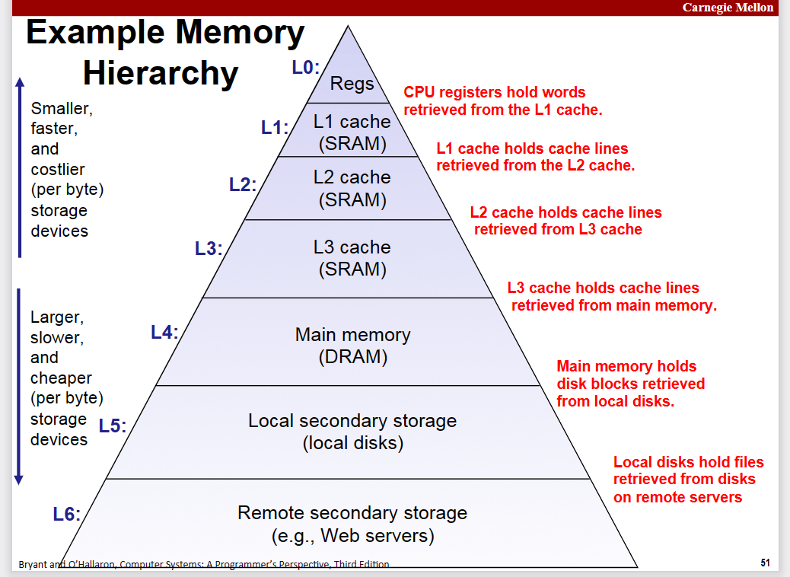 

Cache是更小更快的储存设备，cache机制在存储器层次结构中无处不在。每上一层级都是下一层的缓存。

## 1. cache 储存器
随着cpu和内存之间逐渐增大的差距，寄存器之间和主存之间插入SRAM（L1高速缓存），之后又插入L2 L3，但是这里就假设只有L1高速缓存。这里进行假设，存储器位数m位。

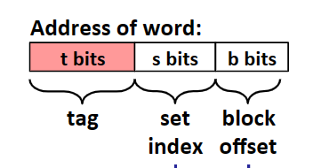 

一个高速缓存分为S组（2^s）,每组E（2^e）高速缓存行，每行是一个 B字节（2^b）的数据块，那么要找到对应的缓存块，就得看地址：t就是代表标记位（行索引），s位就是代表组索引，b就是代表数据块内偏移（看是哪些字节的数据），所以高速缓存结构是（S,E,B,m）大小= S*E*B。
   
特例：E=1，每组只有一行，称为直接映射高级缓存。通常分为三步：组选择，行匹配，字抽取
1. 抽出s位索引位看是哪一组
2. 选完组之后，就是确认该组的所有行中有没有对应的：就是看主存地址的标记位和缓存行的标记位一不一样，并且有效位是否为1（第一位）（这里举例E=1和E=2）  
    
    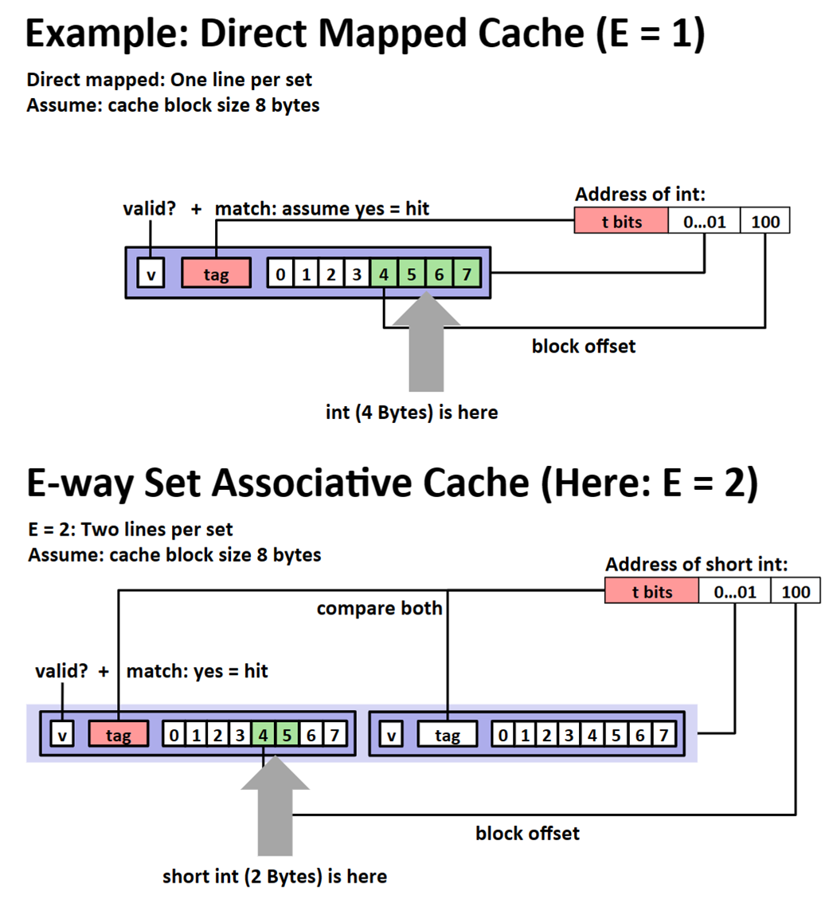 

如果没命中就会进行替换，E=1，直接替换，E=2，lRU或者Random，但是先尽量覆盖空行。  

这里人工模拟一下命中与否：
假如缓存块大小为2字节，地址为4位，每个字都是单字节。最开始如下：
| 组号 | 有效位 | 标记位 | 块[0] | 块[1]|
|----- |-------| ------ |-------|-----|
|0     |0      |       |        |     |
|1|0| | | |
|2|0 | | | |
|3|0 | | | |  

（1）读地址0的字，0000,标记位0 ，0组 ，偏移为0，缓存未命中，直接替换一整行，从块[0]开始
| 组号 | 有效位 | 标记位 | 块[0] | 块[1]|
|-----|-------| ------|----|----|
|0| 1| 0| m[0]|m[1] |
|1| | | | |
|2| | | | |
|3| | | | |

(2) 读地址1，0001，标记位0，0组，偏移量1，命中。
(3) 读地址13，1101，标记位1，2组，偏移量1，未命中
| 组号 | 有效位 | 标记位 | 块[0] | 块[1]|
|-----|-------| ------|----|----|
|0| 1| 0| m[0]|m[1] |
|1| | | | |
|2|1 | 1|m[12] | m[13]|
|3| | | | |

(3) 读地址8，1000，标记位1，0组，偏移量0，未命中,更换
| 组号 | 有效位 | 标记位 | 块[0] | 块[1]|
|-----|-------| ------|----|----|
|0| 1| 1| m[8]|m[9] |
|1| | | | |
|2|1 | 1|m[12] | m[13]|
|3| | | | |

(3) 读地址0，1000，标记位0，0组，偏移量0，未命中,更换
| 组号 | 有效位 | 标记位 | 块[0] | 块[1]|
|-----|-------| ------|----|----|
|0| 1| 0| m[0]|m[1] |
|1| | | | |
|2|1 | 1|m[12] | m[13]|
|3| | | | |

发现个问题，m[0]和m[1]被之前的读地址8给替换了，就会导致命中率实际也不高。上面说的就是组相连。  
关于写操作：两种操作，直接写入（先写cache再写内存）或者写回法（只写cache，被替换时才写内存）。典型的L1 cache 4个时钟周期，L2 cache 10个时钟周期，命中与未命中之间差异太大了。 主存里面得花100的时钟周期往上.....系统对命中率特别敏感。  
通常需要编写时间局部性和空间局部性都比较友好的代码，以矩阵乘法为例：  
ij 矩阵 等于 ik矩阵*kj矩阵。正常代码如下，循环展开顺序为ijk：

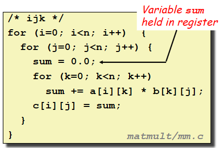 

这样的话，A矩阵缓存命中概率高，B矩阵缓存不好命中。总结一下：

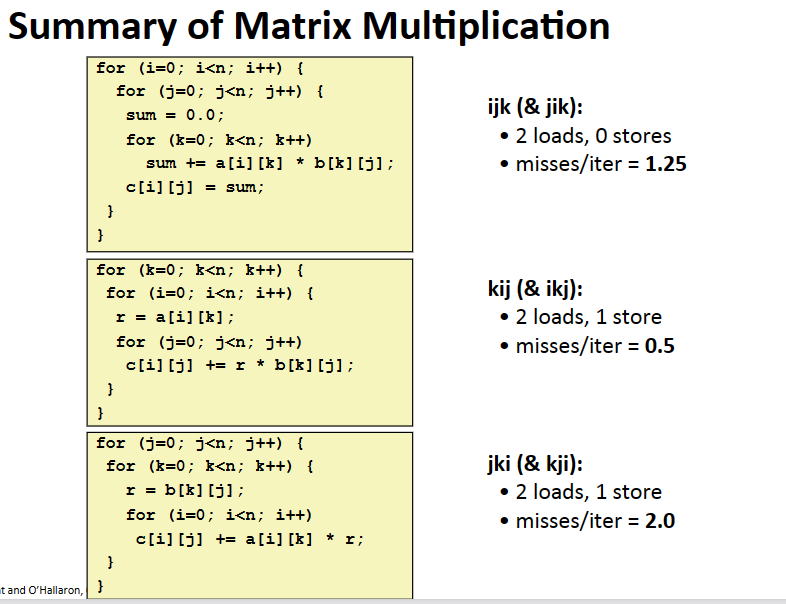 

kij效率最高。把j放到最后，B矩阵缓存命中高，效率就高（暂时还有点理解不了，挖个坑...）。矩阵乘法是改变空间局部性，要改善时间局部性，需要使用block。
> 假设缓存大小是32字节  
> 针对第一种：内循环是以步长1扫描A的行，sum+=a[i][k]*b[k][j]，b的k在增，命中不了（miss 1次），a的k在增，5次访问命中1次 8次访问也是命中1次，9次访问命中2次...4n次访问命中 n-1次，这里简化成 n次（n很大），所以a是miss 0.25次，总的就是 1.25次。
> 针对第二种：直接就是 B数组miss 0.25次，C数组也是命中0.25次。总共0.5次
> 针对第三种：A 和 C都 miss 1次，总共2次。

使用block（分块）改变时间局部性。就是矩阵分块乘法，一次取的多了，之后就更容易缓存命中。举例说明，假设是按 ijk展开，缓存块=8 doubles，缓存大小C << n。之前的就是 9/8 n^3 命中次数。如果使用分块矩阵,矩阵乘法就是：A矩阵的第一小块第一行和B矩阵的第一小块的第一列进行运算。然后加上A矩阵的第二小块的第一行和B矩阵第三小块的第一列进行运算。得到的结果就为C[0][0]，依次类推。代码如下：

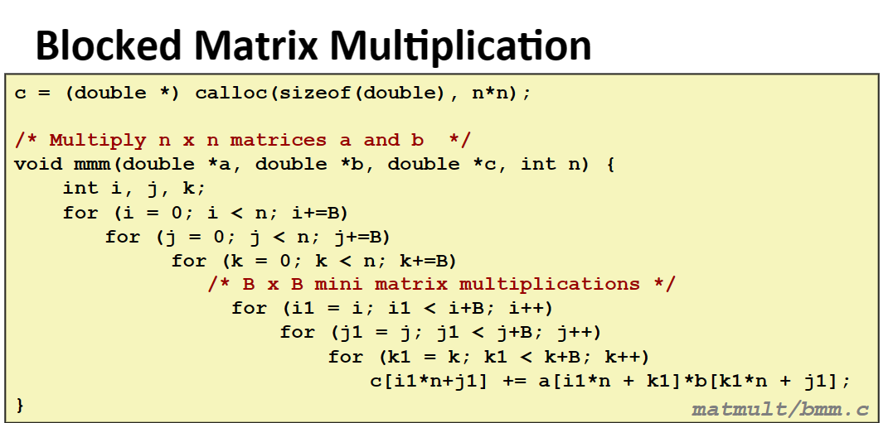 

自己手写模拟一下过程就知道了,就是第二个矩阵的访问也大部分在cache中找...

# 5. 链接
举例说明，就是将一些单独的文件链接到一起，例如 main.c 中调用了 sum.c里面的一些函数，编译命令为：
gcc -Og -o prog main.c sum.c。分别编译main.c 和 sum.c 变成 main.o(可重定向目标文件) 和 sum.o(可重定向目标文件) 然后用链接器链接两个生成 prog(完全目标文件)。  
链接器主要任务：
1. 符号解析：一些函数的定义和引用符号。然后把每个符号引用和一个符号定义关联起来。符号定义是储存在符号表内。
2. 重定向：将符号定义与内存地址绑定起来

目标文件有三种形式：.o(可重定向目标文件) .out(可执行目标文件) .so(共享目标文件)，现代Linux系统采用 ELF（可执行可链接格式）。

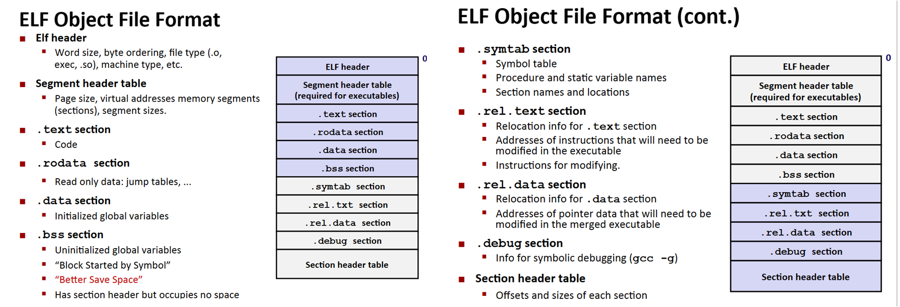 

值得注意的几点：.text 和 .rodata 都是只读 **.dada 保存全局变量和静态变量，局部变量运行时储存在栈中，**.bss不占空间，只是占位符（未初始化的全局变量和静态变量，或者初始化为0的）。  
符号分为三种：（1）全局符号：由模块m定义，且可以被其他模块引用，对应非静态的c函数和全局变量（2）外部符号：外部定义，模块m引用，同样对应非静态的c函数和全局变量 （3）局部符号：只被m定义和引用，外部不可见，对应静态c函数和静态全局变量。 static属性来隐藏模块内部变量和函数声明。  
>注意：静态变量都保存在.data 或者 .bss ,无论是静态全局变量 还是静态局部变量。普通局部变量就在栈中。

## 1. 符号解析
对全局符号解析比较麻烦，因为多个目标文件可能会定义相同名字的全局符号，这个时候就分强弱：函数和初始化的全局变量是强，未初始化的全局变量是弱。所以：
1. 不允许多个同名强符号
2. 一个强符号和多个弱符号，选择强符号
3. 多个弱符号，random选  
举例说明：

    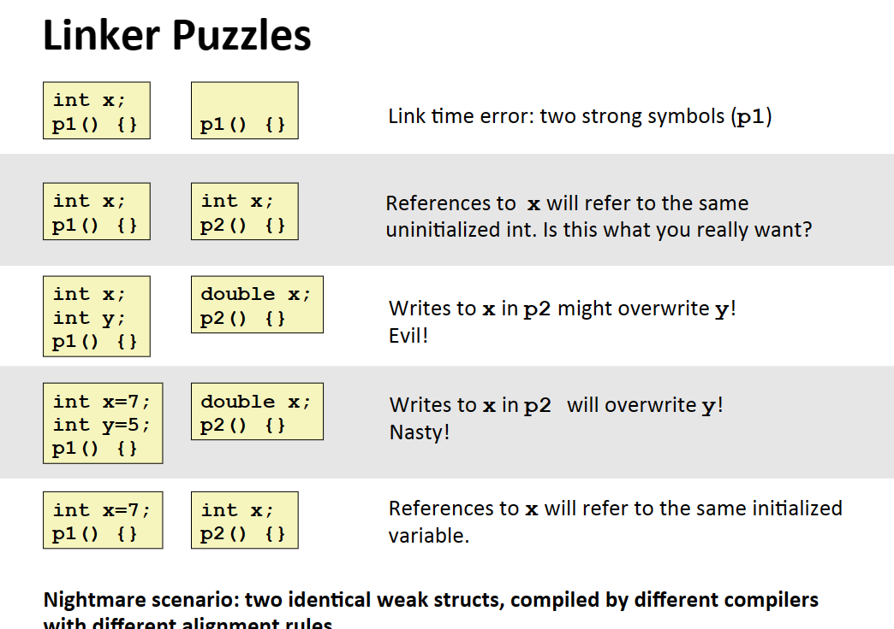 

由于上面这些问题，所以尽量少使用全局变量，如果一定要使用：（1）用static限制其范围（2）初始化（3）如果引用了外部变量，使用 extern
## 2. 重定向
先把每个目标模块的 .data节聚合起来，成为输出的可执行目标文件的.data节，然后将运行时地址赋给对应的符号。然后修改.text 和 .data 对每个符号的引用，指向正确的地址，但是编译器最开始也不知道链接器要链接到哪些地址，所以编译时会有重定位信息生成 ，.rel.text .rel.data。编译时产生的是相对地址，链接时就是把相对地址变为绝对地址。

## 3. 可执行文件
可执行文件也是 ELF格式，但是多了个 _init，去掉了 .rel.xx,因为需要表明入口，且不需要重定向了。最后可执行文件的内存映射如下：

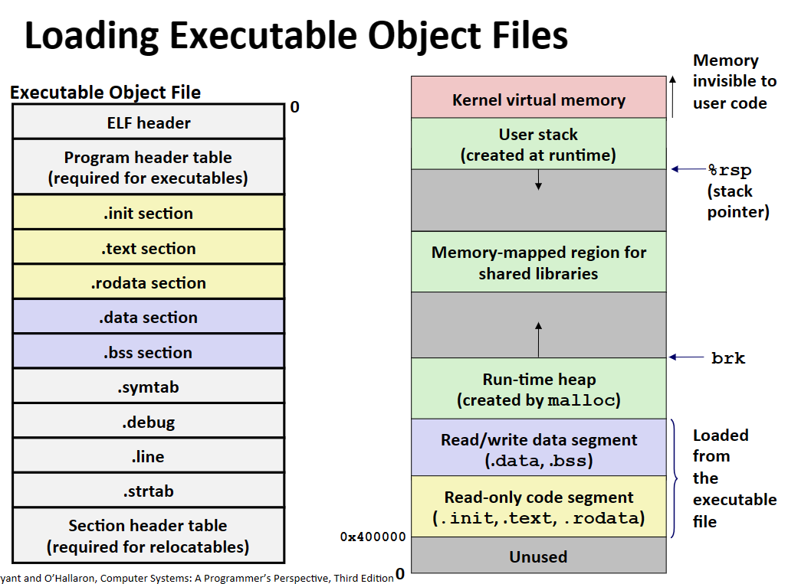 

有栈 堆 共享库的内存映射区 数据段 和 只读代码段。brk（堆的顶端，一般是小内存块）的含义后面会讲。

## 4. 库文件
链接的优势就是可以有很多库。

### 1. 静态库
静态库（.a）以存档（archive）格式存在磁盘里，是一组可重定位目标文件的集合，有一个头部用来描述每个成员目标文件的大小和位置。然后如果使用某个函数，就会把对应函数的.o文件加载进来。  
>`g++ -c source_file.cpp -o source_file.o` 或者 `g++ -c source_file.cpp` 生成.o文件 不链接，要加 -c (compile意思)  
> 使用静态库时链接器具体做的事情：按命令行顺序扫描 .o 和 .a文件，然后尝试解析列表中的未解析的引用，扫描完之后如果还有未解析的符号引用，就error。 通常把.a 库放在命令行最后。

静态库存在缺点就是在一个多进程的电脑上，每个进程都会运行printf，那就会每个进程都把对应的printf.o包含进来然后链接起来。动态库就是只有一个存在，不存在副本, .so文件。

### 2. 动态库
动态库就是链接的时候先留个记录（记录在符号表中），实际运行的时候再加载进去。

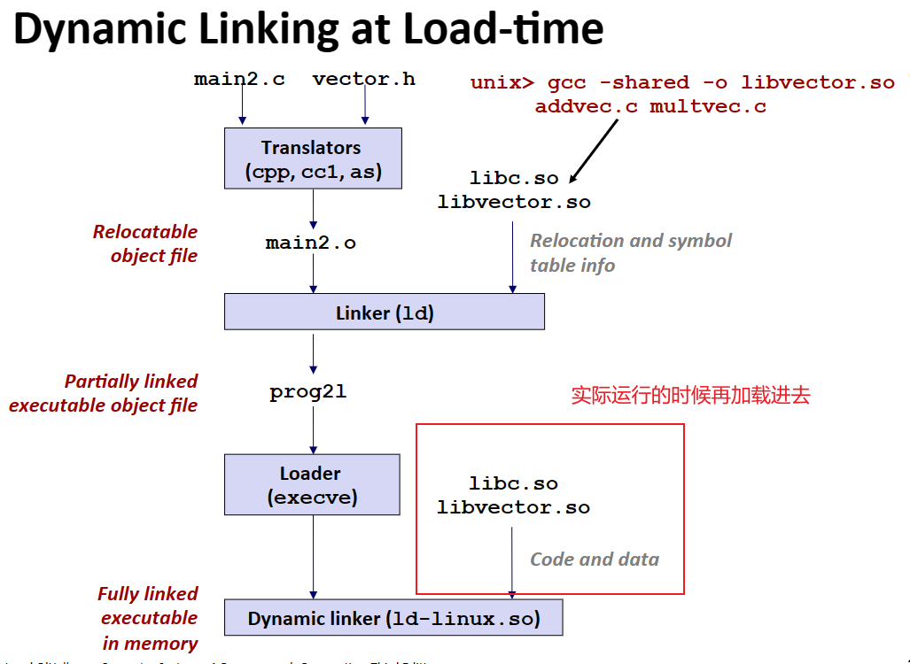 