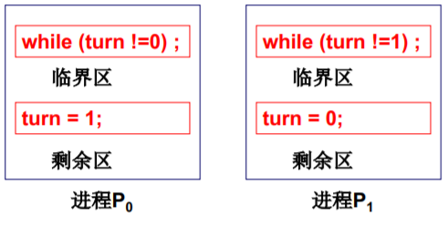

<!-- TOC -->

- [操作系统](#操作系统)
- [1. 操作系统概论](#1-操作系统概论)
  - [1. 操作系统开机](#1-操作系统开机)
  - [2. 操作系统接口](#2-操作系统接口)
  - [3. 系统调用实现](#3-系统调用实现)
  - [4. 学习目标](#4-学习目标)
- [2. cpu管理](#2-cpu管理)
  - [1. 多进程图像](#1-多进程图像)
    - [1. 多进程如何交替](#1-多进程如何交替)
    - [2. 多进程如何影响](#2-多进程如何影响)
    - [3. 多进程如何合作](#3-多进程如何合作)
    - [4. 总结](#4-总结)
  - [2. 进程和线程](#2-进程和线程)
    - [1. 用户级线程](#1-用户级线程)
    - [2. 内核级线程](#2-内核级线程)
    - [3. CPU调度策略和实际的schedule函数](#3-cpu调度策略和实际的schedule函数)
    - [4. 进程同步与信号量](#4-进程同步与信号量)
    - [5. 死锁处理](#5-死锁处理)
- [3. 内存管理](#3-内存管理)
  - [1. 内存使用](#1-内存使用)
  - [2. 内存分区和分页](#2-内存分区和分页)
  - [3. 多级页表跟快表](#3-多级页表跟快表)
  - [4. 段页结合Code示例](#4-段页结合code示例)
  - [5. 内存换入与换出](#5-内存换入与换出)
- [4. IO设备与文件系统](#4-io设备与文件系统)
  - [1. IO设备](#1-io设备)
    - [1. 显示器](#1-显示器)
    - [2. 键盘](#2-键盘)
    - [3. 生磁盘](#3-生磁盘)
      - [1. 生磁盘到文件](#1-生磁盘到文件)
      - [2. 目录与文件系统](#2-目录与文件系统)

<!-- /TOC -->

# 操作系统
[OS参考笔记](https://blog.csdn.net/qq_53111905/article/details/119737978)
# 1. 操作系统概论

## 1. 操作系统开机
操作系统是给计算机硬件（CPU、内存）穿上了衣服，抽象了一层，管理硬件，例如CPU、内存、磁盘、文件、终端等。计算机五大部件：I/O设备 存储器 运算器 和控制器。计算机就是在不断地 “取指执行”，但是要把操作系统从磁盘上载入内存里，才能取指。 
那么打开电源，计算机执行的第一条指令是什么？  
>1. 刚开机，cpu处于**实模式**。CS 寄存器（16位寄存器）（存储当前代码段的基地址）的值乘以16（即左移4位）给出了当前执行的指令的物理内存地址。换句话说，CS 寄存器的值经过位移操作后，会与指令指针（IP/PC）组合，形成完整的内存地址，用于取下一条指令。  
>2. 例如 开机时CS=0xFFFF，IP=0x0000，然后寻址0xFFFF0（内存BIOS映射区）然后自检，接着将磁盘0磁道0扇区（操作系统的引导扇区，一个扇区512字节）读入0x7c00,设置 CS = 0x07c0，IP = 0x0000（说明之后要跳到操作系统来执行了）。  
>3. 引导扇区代码是汇编代码，bootsect.s(读入系统)，然后再执行setup.s（完成OS启动前的设置）,举例：
```
// 将操作系统移到0地址去
// 段寄存器（如DS和ES）与偏移量（如SI和DI）所以是把 ds：si（一个地址）（0x10000） 移到 es：di（一个地址）（0x0000）（ds是数据段寄存器，es是附加段寄存器）
// 段寄存器<<4 + 偏移量 为当前访问地址
    move ax,#0x0000
do_move:
    mov es,ax add ax,0x1000
    cmp ax,#0x9000
    mov ds,ax sub di,di
    sub si,si
    mov cx, 0x8000
    rep movsw
    jmp do_move
```
然后先初始化GDT，然后```mov ax,#0x0001 mov cr0,ax```,导致cr0寄存器最后一位（PE）为1（为1启动保护模式），cpu进入保护模式，然后 ```jmpi,0,8```(将CS设为8，IP设为0)，指向的还是地址0x00。
>为什么存在实模式和保护模式?  
>因为实模式下，寻址空间只是20位（CS寄存器为16位），约1MB，所以要进入保护模式，更换寻址模式。还是通过CS 和 IP来寻址，但是CS中有个选择子（索引），通过GDT（全局描述符表）来取段描述符（有段基址和段界限），之后段地址就是 段描述符基地址+偏移量。如果有分页模式，继续找到页目录索引和页索引，然后页表包含物理帧号和页内偏移量。物理地址=页表帧号*页表大小+页内偏移量。补充一下：保护模式下中断函数 int n，也是去查表IDT，跳向中断处理函数接口，之前直接是单一的中断向量表。

然后再进入system模块，执行head.s,重新初始化IDT GDT,设置页表，然后调用main函数，进行一系列初始化，如内存初始化，main是一个永远不会退出的函数。
> 内存初始化了一个 mem_map的表格，前面used，后面都置为0。  
>   


## 2. 操作系统接口
操作系统接口就是操作系统提供的一些重要函数，也可以叫做系统调用。一般接口形式有两种：命令行和图形化界面。命令行通过shell（在system模块 的main函数的最后启动的），观察这个main函数，意思如下：
>父进程调用fork()创建一个子进程。  
只有子进程会进入if语句的代码块中。  
在子进程中调用exec(cmd)，这将用cmd指定的命令替换当前（子）进程的执行上下文。  
  
    
图形化按钮就是：消息框架程序+消息处理程序。


并且这些重要的函数有个标准（程序换个操作系统也能用）。


## 3. 系统调用实现
直观想法：为什么不能访问内核？反正都是内存中。答：如果应用程序能访问内核，那么root密码或者其他软件的内容都一览无余（如word内容）...  
内核有 用户态 和 内核态。 系统调用就是提供进入内核的手段。


CS:IP指令（PC内的）的**最低两位**表示当前执行在哪个态（0为内核态，3为用户态）只有当 DPL（指令特权级）> CPL（当前特权级）才可以执行指令，**数字越大，特权级越低**。  
但是用户程序也提供唯一调用内核代码的方式：中断（int），int把 CS中的CPL改为0，就直接进入内核态了。系统调用的实现通过 int 0x80，例如prinf 使用了 write，write 系统调用中 包含int指令的代码。  
具体研究一下write 和 int 0x80。 


标红的内嵌汇编意为把 _NR_write（一个宏 4，称为系统调用号） （这里name用write替代了）赋给 eax。同时eax也存放返回值，ebx，ecx，edx存放3个参数。这个宏函数名： syscall3中的3就代表3个参数。然后就开始根据系统调用号（4）执行相对于代码。 
int 0x80具体干了什么？


set_system_gate来设置0x80的中断处理，同时把dpl赋为3。system_call为中断处理程序。所以总体流程是先把 dpl设置为3，让代码能够进入内核，进入内核之后，一系列操作把 cpl设为 0，然后就可以进行一系列操作了。`sys_call_table + 4* %eax` 代表相应系统调用处理函数（4代表每个系统调用占4个字节:32位下每个指针占4个字节），sys_call_table 就是个函数表。总体流程如下：


sys_write是系统调用函数,现在还没必要深入了解...

## 4. 学习目标


# 2. cpu管理
通过多进程管理好了cpu。cpu工作就是**不断自动取址执行（取PC里面的地址）**，所以设好PC初值就可以，就会按顺序执行指令...但是存在问题：
```
// fprintf（I/O指令）运行时间太长，会让CPU空等...
int main(int argc, char* argv[])
{
	int i , to, *fp, sum = 0;
	to = atoi(argv[1]);
	for(i=1; i<=to; i++)
	{
		sum = sum + i;
		fprintf(fp,“%d”, sum);
	}
}
```
所以实际cpu运行是这样：等的时候就去干其他事情，多个程序交替执行（并发）。


怎么做到并发？ （1）切换PC（2）切换的时候记录返回地址 （3）保存切换前的上下文（如寄存器的信息）。所以每个程序有个存放信息的结构：PCB(process control block,进程控制块)。因此有进程（进行中的程序），**进程走走停停，需要PCB**(类似于备忘录)。

## 1. 多进程图像
多进程图像就是多个进程向前跑的样子，就是管理cpu的核心样子。开机时候：main里面的`if(!fork()){init();}` 创建了第一个进程，init()函数里面启动了shell，shell代码如下，shell根据cmd启动其他进程...（windows是启动桌面 ）  
  
多进程如何组织，有队列，且状态模型如下：  
  
运行态到堵塞态理解为饭卡找不着了（等待某事件），堵塞到就绪就是饭卡找到了（等待事情发生），然后重新排队，阿姨叫到你了（OS调度），打饭，打完重新打，需要重新排队（就绪态）。 ps：进程是由内核控制的。 

### 1. 多进程如何交替
切换就是 schedule 函数。但是进程调度太复杂，基本的就是FIFO（先进先出），但是没有考虑进程任务的优先级区别。我们看switch_to的代码：
```
// 就是把旧的cpu状态 保存在当前pCur（PCB）中，让 CPU去执行新的PCB(pNew)
switch_to(pCur,pNew){
  pCur.ax = CPU.ax;
  pCur.bx = CPU.bx;
  ...
  pCur.cs = CPU.cs;
  pCur.retpc = CPU.pc; //old

  CPU.ax = pNew.ax;  //new
  CPU.bx = pNew.bx;
  ...
  CPU.cs = pNew.cs;
  CPU.retpc = pNew.pc; 
}
```
### 2. 多进程如何影响
多进程都是放在内存中，就会出现问题（进程之间会互相更改信息），所以不同进程之间应该地址隔离。  
  
**通过进程映射表**，比如进程1和进程2中的地址100对应的是地址实际的780 和 1260，这样就隔离了。

### 3. 多进程如何合作
假如多个进程通常往一个内存位置write，就会乱套，**所以需要加锁**。如生产者消费者实例，核心在于进程同步。

### 4. 总结
多进程图像要有（1）读写PCB（2）操作寄存器保存上下文（3）写调度程序（4）进程同步（5）地址映射（地址隔离）。

## 2. 进程和线程
### 1. 用户级线程
因为进程切换代价太大了（要切换映射表以及保存上下文信息），所以引出线程（共用映射表），保留并发特点，实际上就是资源不变，只切换执行指令（PC指针）。考虑一下多线程是否实用，举例说明：
> 其实可以这样理解：解耦成 多个指令交替执行 + 是否共用映射表，进程和线程的共同点是多个指令交替执行  
>例如浏览器有多个线程，一个线程用来显示文字，一个线程用来显示图片,一个线程用来下载... 这些线程共享资源。  

浏览器主干实现代码如下： 
```
void WebExplorer() { 
	char URL[] = “http://cms.hit.edu.cn”;
	char buffer[1000];   // 共用数据缓存区
	pthread_create(..., GetData, URL, buffer); //GetData
	pthread_create(..., Show, buffer); //Show
}
void GetData(char *URL, char *p){...};
void Show(char *p){...};
```
但是上述代码还没有实现 **指令交替执行** 的效果，因此在GetData和Show函数之内，有一个关键函数`Yield`,Yeild实现切换线程，是线程调度操作，它允许当前线程放弃对CPU的使用，即使它仍有时间片剩余。执行 yield 的线程将回到就绪队列。看看create 和 Yield的具体实现。

  

两个线程应当有两个栈，如图所示。所以就需要有TCB，存栈指针。TCB和栈相互配合，考虑一下 jmp 204为什么去掉，试着模拟一下过程。
> 假如有 jmp 204，那么直接跳到204,执行完之后，然后ret（出栈204），会发现又执行204，这就会出问题。假如把 jmp 204去掉， yield函数返回，那么就会出栈（204），然后执行204。然后函数继续返回，出栈104，执行104。

所以，yeild的任务就是 切换栈，**不需要jmp** ！  
create就是要把yield使用到的东西都创建出来：（1）TCB （2）栈（3）TCB和栈关联起来
```
void ThreadCreate(A)
{
	TCB *tcb=malloc();
	*stack=malloc();
	*stack = A;//100
	tcb.esp=stack;   // 关联TCB和栈
}
```
上述是用户级线程（由用户手动切换），Yield是用户程序。但是存在问题，假如用户级线程进入内核堵塞（这里举例，网不好，就会去内核调用网卡IO，但是现在程序仍处于用户态），OS就会切换进程（因为不知道TCB），而不是切换线程，这样线程的并发性就丧失了。核心级线程是系统调用，会进入内核，内核管理PCB，负责切换线程。
### 2. 内核级线程
进程都是内核态，没有用户级进程这一说法，因为进程需要的资源都是计算机来分配，都是在内核态。补充个概念：多cpu和多核，多cpu就如字面意思，多核就是多个处理核心共享同一资源，而多cpu中的每个cpu都有自己独立的缓存。  
现在核心级线程有一套栈（一个用户栈和一个内核栈），之前是根据TCB来切换用户栈，现在TCB切换，用户栈和内核栈都要切，就是切一套栈。但是TCB是关联内核栈，用户栈怎么切？

  
 

用户栈跟内核栈的关联如上：用户栈切换到内核栈通过中断，然后将 栈的始尾指针保存过去，和指令地址（PC CS），然后IRET（中断返回）返回的时候，就弹栈找到之前用户栈在的位置。然后内核栈之间切换用switch_to函数。一般线程大部分都是工作在用户态，只是用到内核的时候，去内核溜达一圈，然后直接通过CS:PC 返回用户态程序。所以有两套栈的切换。（包含内核栈和用户栈）。switch_to 的五段论：

 

同样切换知道了，那么创建一样需要创建：（1）用户栈（2）内核栈（3）TCB（4）TCB跟内核栈的关联。  
内核级线程实现如下：

 

OS就是一颗树，CPU就是种子，不断取址执行。然后并行处理（CPU好好运转，指令跳转），是对前面的总结，思维循循渐进。举例说明：从一个简单、清晰、明确的目标开始 交替的打出A和B (Linux 0.01)  
从用户代码开始：比较复杂，自己去做lab就知道了..
```
main()
{
	if(!fork()){while(1)printf(“A”);}
	if(!fork()){while(1)printf(“B”);}  // 时钟中断切换 A 和 B
	wait(); // 将父进程变成堵塞态，然后调用schedule函数，schedule是调度，选择合适的进程，然后switch_to 切换
}
```
### 3. CPU调度策略和实际的schedule函数
cpu调度就是 选择 next process。schedule函数。常见的策略：
1. FIFO，先进先出，但是如果只是简单询问业务的人？
2. 考虑Priority，任务短可以适当优先。
3. 让进程满意：（1）尽快结束任务（2）尽快响应用户操作（3）系统内耗时间少（尽可能让系统一直在工作），但是通常存在折中，前台性任务要求响应时间，后台性任务要求周转时间（尽快完成任务）。所以针对不同的要求，有不同的策略...  

实际的基本CPU调度算法示例：
1. SJF: 短作业优先，导致周转时间最小，用小顶堆来实现。
2. 时间片调度：改善响应时间，一个个给一点点时间片，用完就下一个。
3. 周转时间和响应时间都要求：例如word关心响应时间，gcc关心周转时间，直观想法：前台任务 和后台任务队列，前台任务采用时间片调度，后台采用SJF，前台任务队列没了才去调度后台任务队列。这样会存在问题：后台任务容易陷入饥饿状态。解决方法：采用动态优先级，前台任务和后台任务优先级动态变化...(后台任务以SJF为核心，但是也要加时间片，这样执行久的话就可以跳转前台任务)

一个实际的schedule函数如下：
```
/* this is the scheduler proper: */
while (1) {
  c = -1;  
  next = 0;
  i = NR_TASKS;   // num_Tasks
  p = &task[NR_TASKS]; // p队列地址
  while (--i) {
    if (!*--p)
      continue;
    // 如果状态是就绪（TASK_RUNNING）且 counter > c
    if ((*p)->state == TASK_RUNNING && (*p)->counter > c)  
      c = (*p)->counter, next = i;
  }

  if (c) break;   // 找到了最大的counter所在的Task,直接跳出
  
  // 如果所有就绪态的counter都为0，时间片都用完了。当然要考虑那些堵塞态的，堵塞态此时counter不为0
  for(p = &LAST_TASK ; p > &FIRST_TASK ; --p)
  { 
    if (*p)
    {
      (*p)->counter = ((*p)->counter >> 1) + (*p)->priority;  // 如果是就绪态 counter就是 priority，堵塞态的就要大于 priority，导致堵塞态优先级高点
    }
  }
}
switch_to(next);
```
上面的代码保证堵塞态变为就绪态的进程优先级要高于那些直接是就绪态的进程，且I/O时间越长的，counter越久，所以这里counter的作用既有时间片作用又有优先级作用...counter作用总结：
1. counter保证了响应时间的界，就是 p+p/2 + p/4 ... = p(1-(1/2)^n)/0.5 < 2p (p为counter初值)
2. 经过IO以后，counter就会变大；IO时间越长，counter越大(为什么? 被阻塞的多了)，照顾了 IO进程，变相的照顾了前台进程
3. 后台进程一直按照counter轮转，**近似了**SJF调度 (短作业的先轮转完)
4. 每个进程只用维护一个counter变量，简单、高效

### 4. 进程同步与信号量
进程同步通过信号，A进程等信号，B进程发信号。这里的信号就是信号量。并且信号量对应睡眠和唤醒，且要记录有多少个进程在等待，那么就要唤醒多少次。如下：

 

看上面，什么时候-1，什么时候+1：正的:供小于求，负的:供大于求....  信号量定义如下,是一种特殊的整型：
```
struct semaphore
{
	int value; //记录资源个数
	PCB *queue;
	//记录等待在该信号量上的进程，堵塞的进程
}
P(semaphore s); // test一下，看需不需要阻塞
V(semaphore s); // 增加资源
P(semaphore s)
{
	s.value--; //使用了一个资源
  // 如果没资源了可用了
	if(s.value < 0) { 
		  sleep(s.queue);  //阻塞
    }
}

V(semaphore s) 
{
    s.value++; // 释放了一个资源
    // 说明queue里面有等待的进程，就wakeup
    if(s.value <= 0) { // p中睡眠的 s
        wakeup(s.queue); //唤醒
    }
}
```
这里的P和V需要做成系统调用，用户程序进行系统调用。以生产者和消费者示例为例，用信号量解决问题(生产者可以有多个)：
```
int fd = open(“buffer.txt”);
write(fd, 0, sizeof(int)); //写in
write(fd, 0, sizeof(int)); //写out 

// Init 信号量
semaphore full = 0;   // 代表缓冲区占用的空间
semaphore empty = BUFFER_SIZE;   // 代表空闲缓冲区有多少个
semaphore mutex = 1; // 互斥锁，初值为1，代表没有进程访问缓冲区，mutex为0就不行，说明有人在操作

// 生产者什么时候停，就是缓冲区满的时候
Producer(Item){
  P(empty);  // empty -
  P(mutex);
  将item写入in 的位置上
  V(mutex);
  V(full); // full +
}

Consumer() {
	P(full); //full -
	P(mutex);
	读入out;从文件中的out位置读出到item;打印item;
	V(mutex);
	V(empty); //empty + 1
}
```
信号量可以实现同步，但是为什么要保护信号量？因为需要确保信号量的正确性（在共同修改信号量的情形下），所以直观操作：在写共享变量empty 时阻止其他进程也访 问empty。这就是临界区：一次只允许一个进程进入的该进程的那几段代码中的一段。**信号量的读写一定是在临界区代码处**。临界区代码要求：（1）互斥进入（2）有空让进（3）有限等待（不能让某一进程饥饿）。进入临界区的方法有以下几种示例：
1. 轮换法，类似于值日；但是不满足有空让进
   
    
2. 标记法，留个标记，执行的指令顺序会导致两个进程都无限等待，flag[0] 和 flag[1] 都为 true..
   
    
  
    解决方法： 选择一个进程进入，另一个进程循环等待。用通俗的话来讲：丈夫和妻子都留条了，妻子看到丈夫留条就不管了，不去买，但是丈夫多个心眼，他会时不时去看看到底有没有买回来，没买回来还得自己去买。  
      
    就是把标记和轮换综合了。
3. 多个进程就是面包店算法：标记+轮转。进程获得序号（不为0），序号最小的进入。离开时，序号标记为0,想进来时，重新获得个大序号。但是这个好像太复杂了....
4. 通过硬件来实现：只允许一个进程，就是cpu阻止其他进程调度，通过关中断来实现，但是只使用于单cpu。
5. 通过硬件来实现：硬件原子指令法，锁是什么？计算机里面就是个变量，**这个变量应该通过硬件来实现保护**，如果软件来实现保护，就会无穷嵌套，所以可以在硬件上把对mutex的修改做成一条指令（一步完成），立刻上锁。
   ```
    boolean
    TestAndSet(boolean &x)
    {
      boolean rv = x;  // 如果x为 false， 返回false，就进入临界区， x为true，上锁了，出来之后，才解锁
      x = true;
      return rv;
    }

    while(TestAndSet(& lock)) ; //临界区
    lock = false; //剩余区
   ```

看实际Linux0.11信号量实现源码如下：(源码只是先看看，最好还是通过lab去做)  
   
1. 首先有个信号量数组，存了所有的信号量。open函数就是有则返回下标，无则创建再返回下标。
2. 生产者程序：先open，再wait，wait函数就是先停止时间片中断（避免调度其他进程），再看自己是不是堵塞了，堵塞了就加入queue，调用schedule函数

### 5. 死锁处理
死锁：多个进程互相等待对方持有的资源，导致谁都无法执行。死锁形成的四个条件：
1. 互斥使用：资源的固有属性决定
2. 不可抢占：A进程不能抢B进程的资源
3. 请求和保持：必须占有资源才能去申请
4. 有环路

那怎么处理死锁呢？
1. 死锁预防：破坏死锁出现的条件
   1. 一次性申请所有的资源，不会出现 2 和 3
   2. 对资源进行排序，资源申请按序进行，不会形成环路
2. 死锁避免：检测每个资源请求，造成死锁就拒绝
   1. 判断进程是否存在可完成的执行序列，是则设为安全状态，使用银行家算法去计算可用序列（就是一个个试，先把P1作为第一种，以此类推，**其时间复杂度较高，O(m * n*n)**）
   2. 请求出现时: 首先假装分配，然后调用银行家算法(测试是否会造成死锁)
3. 死锁检测+恢复：检测到死锁后，让进程回滚
   1. 发现资源利用率低时，再去调用银行家算法检测(因为银行家算法时间复杂度太高)
   2. 但是回滚，滚到什么状态 和 选择谁回滚，不好选择且麻烦
4. 死锁忽略：不管它，无所谓，比如直接重启
   1. 死锁预防和处理有点麻烦，所以一般PC机，都采用死锁忽略方法，代价最小，死锁了就重启

# 3. 内存管理
## 1. 内存使用
程序放到内存中，PC指向开始地址。编译时，地址都是相对地址（偏移），要放到内存中，需要重定位（修改程序中的地址）为物理地址。
>重定位什么时候完成？  
>编译时或者载入时，如果是编译时完成重定位，那么就得在编译时就知道哪一段内存是空闲的，但是执行的时候可能不是空闲了，就会出现问题..一般嵌入式设备采用编译时重定位  
>载入时重定位，载入的时候再去找空闲位置的基地址，然后让逻辑地址加上基地址，比较灵活..

如果程序载入后还需要移动...  
    
所以就是运行时重定位（在运行每条指令时，才完成重定位），每执行一条指令都要从逻辑地址计算出物理地址（地址翻译），那么基址放在哪呢？放在PCB中，执行指令，先从PCB把基址取出来。每条指令都需要执行地址翻译，通过硬件来实现（MMU，内存管理单元）。进程切换时根据PCB切换来切换基地址（从PCB拿出来存在基地址寄存器）  

整个程序一起载入内存中吗？NO！分段！程序由若干段组成：代码段、数据段、堆和栈等，进行独立分配管理。指令通过 段号.段内偏移来定位，程序分段放入内存。那么跟之前的，PCB还是只放一个基址吗？ NO！需要放每一段的基址！  
  
这个段表就是LDT表，之前操作系统启动的时候有个GDT表，GDT就是操作系统的段表,每个进程都有自己的LDT表（进程段表）。  

## 2. 内存分区和分页
程序分为多个段（编译期）-> 在内存中找空闲区域 -> 磁盘读写，找一段空闲分区读入内存 并用一块表将映射关系做好.  
内存怎么割？等分？（但是段有大有小，需求不一样）只能 可变分区。存在空闲分区表和已分配分区表。但是怎么选择不同的空闲分区？
>首先适配——均匀随机的选择 O(1)  
>最佳适配——与目标内存差距最小的选择 O(N)，导致内存块不太均匀    
>最佳适配——与目标内存差距最大的选择 O(N)，导致内存块比较均匀  
>思考这样一个问题：段内存请求很不规则，有时需要大的，有时需要小的，这时选择最佳适配（因为不均匀）  

实际是分页，而不是内存分区（**使用于虚拟内存，后续开讲**）。内存分区会导致一堆内存碎片，所以用分页（物理内存中）。  
>从连续到离散… （程序员角度要求分段，物理内存角度要求分页）,针对每个段请求，系统一页一页的分配给其他段，在物理内存不一定连续  

  
现在页已经载入内存，接下来看指令怎么查找？例如 jmp 40,要通过页表来查询，通常一页是 4K，页放在页框里..
  
地址是0x2240 除以 4k(左移12位，这里是16进制)，得到的就是页号，余数就是偏移.. 0x02,0x240，就可以根据页表找到对应的页框，然后页内偏移0x240,页框实际上才是物理地址，**看图，第2页在页框3，因此实际物理地址就是 0x3240**.. 这个都是MMU完成的。页表是放在页表寄存器里面,通过页表指针与PCB关联，段表也是一样。  

## 3. 多级页表跟快表
为了提高内存使用率，页应该小，但是页小，页表项增加，页表大了,页表中的页号都是逻辑页号，页框才是物理的。页表大，页表的放置就存在问题，页面尺寸通常4K，地址是32位的，那就是有 2^20个页，都要放在内存中，每个页表项通常4Byte，那就是 4M,并发10个进程，就是 40M内存... 所以需要把页表尽量搞小点
1. 尝试只放用到的页：但是这样查页表太麻烦了...需要多次访问内存中的页表
2. 所以必须连续的页（访问一次就够了），要不然查找起来太麻烦。所以页表的表项降不下来..类比书的目录，可以有多级目录，依次定位到哪一页.. 使用页目录号 + 页号 + 页内偏移，如下所示：  
      
    
    但是多级页表增加了访存的次数，多找了一次，所以用快表弥补（TLB）是相联快速存储寄存器，可以快速根据逻辑页找到物理页，跟缓存很像...如果TLB命中就非常好，没有命中就通过多级页表去查，然后将其放在快表中。  
       

果然，Cache机制在计算机里面无处不在...由于程序的局部性
## 4. 段页结合Code示例
程序员希望用段，物理内存希望用页，所以需要段页结合的虚拟内存,虚拟内存将段和页的功能结合.. 逻辑地址 -> 虚拟内存 -> 物理内存  
  
用户给的地址还是段号+ 偏移（CS:IP,逻辑地址）然后计算得到虚拟地址，然后通过页表得到物理地址，将物理地址发到总线上去取址执行。  
从fork开始：fork() -> sys_fork -> copy_process copy_process 就是复制进程的上下文状态..  
```
//在linux/kernel/fork.c中
int copy_process(int nr, long ebp,...)
{ ...
copy_mem(nr, p); ...
}
```
直接看 copy_mem函数...
```
int copy_mem(int nr, task_struct *p)
{
unsigned long new_data_base;
new_data_base=nr*0x4000000; //64M*nr	分割虚拟内存  nr为进程的索引，意味着每个进程64M，互不重叠
set_base(p->ldt[1],new_data_base); // 完成对段表的填写  ldt
set_base(p->ldt[2],new_data_base); 
    ...
}
```
接下来就是分页，虚拟地址对应页... 这里有个简化，就是进程互不重叠，那么可以共用页表（实际上肯定会重叠的，主要这是Linux0.1比较简单）。  
```
int copy_mem(int nr, task_struct *p) //不用分配内存，用父进程
{
  unsigned long old_data_base;
  old_data_base=get_base(current->ldt[2]);
  copy_page_tables(old_data_base,new_data_base,data_limit); // 将父进程的页 copy..
  ...
}

int copy_page_tables(unsigned long from,unsigned long to, long size) //建页表
{ 
  from_dir = (unsigned long *)((from>>20)&0xffc);   
  to_dir = (unsigned long *)((to>>20)&0xffc);
  size = (unsigned long)(size+0x3fffff)>>22;
  for(; size-->0; from_dir++, to_dir++)
  {
    from_page_table=(0xfffff000&*from_dir);   // 取页号
    to_page_table=get_free_page(); // 新页
    
    ....
```

```
from_dir = (unsigned long *)((from>>20)&0xffc);
to_dir = (unsigned long *)((to>>20)&0xffc);
size = (unsigned long)(size+0x3fffff)>>22;
from是32位虚拟地址，from>>22得到目录项编号 (from>>22)4每项4字节
&0xffc 把最后两位清为0
```
上面是取页目录号，现在就取页号..
```
for(; size-->0; from_dir++, to_dir++){
  to_page_table=get_free_page();	//建立映射	虚拟地址——物理地址
  *to_dir=((unsigned long)to_page_table)|7; //赋予页目录的地址
```
 

然后就是把源目录页东西拷贝过去...
```
for(;nr-->0;from_page_table++,to_page_table++){
  this_page = *from_page_table;   // 取出内容
  this_page&=~2;//只读	因为是共享的，所以是只读的，  &~2——把最后两位清0   这里是共享的，实际上指向的还是同一个物理内存
  *to_page_table=this_page;    // 赋给 to_page_table
  *from_page_table=this_page;
  this_page -= LOW_MEM; this_page >>= 12;
  mem_map[this_page]++; //共享 引用+1 
  .....
}
```
这里只是建了个页表，指向同一内存.. 段表和页表弄好，MMU自动完成..  
   
图中，进程因为代码相同，逻辑地址都一样，只是基址不一样，所以都是0x300，然后转为不同的虚拟地址..但是由于子进程设置了只读，所以，不能直接往内存里面写7，0x00800300是虚拟地址通过MMU之后还是之前的物理地址，但是因为只读，所以需要申请新的内存页，新的物理内存就是 0x0008300...
## 5. 内存换入与换出
用户眼里的内存：拥有4G(以32位为例)，用换入换出实现 “大内存”...  
  
当换入的时候，虚拟内存映射的物理地址不存在时，发生缺页错误，需要请求调页（中断），硬件帮做，cpu去干其他的。页错误处理程序就是从磁盘中加载指令和数据在物理内存中找个空闲处放进去，然后更新页表。    
  
实际系统的请求调页如下,从缺页中断（14号中断）开始，用page_fault处理中断，主要函数就是 do_no_page(从磁盘中移入物理内存，更新页表)：
```
//在linux/mm/memory.c中
void do_no_page(unsigned long error_code,unsigned long address)
{
  address&=0xfffff000; //页面地址,把最后12位去掉
  tmp=address–current->start_code; //页面对应的偏移
  if(!current->executable||tmp>=current->end_data){
  get_empty_page(address); return; }
  page=get_free_page();   // 得到物理空闲页
  bread_page(page, current->executable->i_dev, nr); //读文件系统
  put_page(page, address); //建立虚拟地址和页的映射 page就是物理空闲页的地址， address就是虚拟地址

// 看put_page函数
//在linux/mm/memory.c中
unsigned long put_page(unsigned long page,unsigned long address)
{
  unsigned long tmp， *page_table;
  page_table=(unsigned long *)((address>>20)&ffc); //页目录项 前面讲过的
  if((*page_table)&1) // 检查最低位是否有效
    page_table=(unsigned long*)(0xfffff000&*page_table);
  else{
    tmp=get_free_page();
    *page_table=tmp|7;
    page_table=(unsigned long*)tmp;
  }
    page_table[(address>>12)&0x3ff] = page|7;   //物理页放在page_table
    return page;
}
// 通常代码只是伪代码，不需要看具体实现，大概了解流程即可...毕竟代码也不全
```
上述是内存换入（从磁盘到物理内存），现在讲内存换出,类比于商店跟仓库，如果商店满了，仓库里拿东西进商店，那么对应商店也有东西要进仓库（物理内存到磁盘）。主要就是上面的 get_free_page(),并不能总是获得新的页，那么选择哪一页换出到磁盘？LRU（选择最近最少使用的）。怎么实现？  
1. 每页维护一个时间戳，选最小时间戳的那一页，实际不太好处理，因为每执行一条指令都要更新，且时间戳容易溢出
2. 页码栈，也麻烦，在栈里要移动比较多次东西..
3. LRU近似实现：将时间计数变为是和否，用一个位，访问了就置为1，选择淘汰页时，扫描该位，是1时清0（给第二次机会），继续扫描，是0就淘汰。就是看最近没有使用 近似 最近最少使用，主要是改一位，且硬件MMU实现，所以代价较小...
   上面Clock算法的改进：
   1. 缺页很少，所有的R=1，搜索一圈回到开始，页面置换效果不好，所以选择一个指针扫描用来清除R位（快指针），选择淘汰页，用移动速度慢的指针，双指针像时钟，所以叫clock算法...

置换策略有了，那么分配多少页框（帧）。进程增多->缺页率增大 -> CPU利用率下降，因为时间都用在磁盘和内存中数据交换.. 这个现象称之为颠簸..  
ps: 磁盘跟内存那个交换区就叫做 swap分区

# 4. IO设备与文件系统
## 1. IO设备
### 1. 显示器
操作系统给用户提供文件视图，对应不同的设备，不同设备有不同的文件视图。通常不管是什么设备，都是统一的接口，例如open、read、write等，不同设备对应不同的设备文件，根据设备文件找到对应控制器地址、内容格式等。外设驱动的三件事情：
1. 发出out指令(最核心的指令)  cpu把数据发到输出设备
2. 形成文件视图
3. 形成中断处理

文件视图如下：  
  

以printf为例，printf就是把字符保存到buf里面，然后write..
```
// 在linux/fs/read_write.c中
int sys_write(unsigned int fd, char *buf,int count) //fd是找到file的索引! 文件描述符
{
  struct file* file;
  file = current->filp[fd];  //current为当前进程， filp是打开文件的指针
  inode = file->f_inode;     // inode为文件的某些信息

```
fd =1 的flip是fork得到的.. 最开始肯定是shell（父进程）打开的，其实就是终端设备
```
int copy_process(...)
{
  *p = *current;
  for (i=0; i<NR_OPEN;i++)
  if ((f=p->filp[i])) f->f_count++;     // f_count就是打开文件的个数
```
核心步骤如下：  
  
这个inode其实就是除了文件名以外的所有信息，fd=1，就是dev/tty0的设备，最后write都是跳转到 out 输出...(终端设备就是键盘和显示器，一个读一个写)  
主要汇编就是 mov ax,pos. 将缓存区内写入显存寄存器（pos），写完一个就pos+=2,为什么是2，因为不仅有字符还有字符属性。具体过程如下：    
  
上面的汇编 mov pos,c 是把c移到pos，不同的汇编format而已，printf主要就是将mov pos, c 指令包装成 统一的文件view
并利用了缓冲技术和 消费者和生产者同步的机制，这个文件view主要就是设备驱动，或者说设备文件..
### 2. 键盘
敲键盘就形成中断，从中断初始化开始..
```
void con_init(void) //应为键盘也是console的一部分
{ set_trap_gate(0x21, &keyboard_interrupt); }   // 跳到keyboard_interrupt中断处理函数

// 在kernel/chr_drv/keyboard.S中
.globl _keyboard_interrupt
_keyboard_interrupt:
inb $0x60,%al //从端口0x60读扫描码   最核心的指令   跟out相反，这个是读入
call key_table(,%eax,4) //调用key_table+eax*4    key_table就是个函数数组，执行里面显示字符的函数
... push $0 call _do_tty_interrupt    
```
接着从key_map中取出ASCII码，put_queue将ASCII码放到 con.read_q 队列。
  
先把数据放到read_q里面，然后处理，然后回显（read_q 到write_q队列中），显示在屏幕上。  
  

### 3. 生磁盘
磁盘结构如下：  
  
磁盘读写:控制器->磁头移动到磁道 -> 磁道旋转到对应扇区 -> 磁生电/电生磁,最直接的使用磁盘通常只要往控制器里面写入 柱面 磁头 扇区 缓存位置...  (ps:先确定哪个柱面，就移动到对应磁道，然后确定哪个盘面，就到盘面，然后确定哪个位置，到对应扇区，每个盘面都有个磁头，所以盘面标志着磁头)
  
上面的需要知道的太多了，所以需要抽象一下...  
1. 第一层抽象就是通过盘块号（block），驱动从block计算成chs，从一维转为三维，这样编址的原因是为了保证block相邻的盘块可以快速读出。磁盘访问时间主要耗费在寻道时间，所以尽可能减少**寻道次数**， C * (Heads * Sectors) + H * Sectors + S 这就是得到的扇区号(Block)... 发现存在问题：上面的block 好像跟 扇区一样一样的，为什么要改成叫盘块号呢？ 答：扇区大小一定，一个block可能会有多个扇区，每次多读几个扇区，增大读写速度，但是也有可能导致碎片比较多（有些空间用不到，但是读了）,通过block 计算扇区号，然后通过取余 计算 C H S
2. 实际使用中，多个进程存在多个磁盘请求，需放到请求队列中，这为第二层抽象（磁盘调度）..目标在于减少寻道次数
   1. FCFS，先进先服务，磁头会长途奔袭..
   2. SSTF,短寻道优先，就是看附近有没有磁盘请求，有的话就执行，这种会导致 远处的请求 饥饿..
   3. SCAN 磁盘调度，就是SSTF + 中途不回折 ，C-SCAN 电梯算法， SCAN + 直接移动到另一端，两端请求都能很快处理，跟电梯一样，中间不带人，直接上去..
   4. 电梯算法最常用..

生磁盘是直接访问磁盘硬件,(1) 进程“得到盘块号” ，算出扇区号(sector) (2) 用扇区号make req (本课程略去) ，用电梯算法add_request (3) 进程sleep_on (进程同步) (4) 磁盘中断处理。 (5) do_hd_request算出cyl,head,sector (6) hd_out调用outp(…)完成端口写  
这里怎么得到的盘块号呢？  

#### 1. 生磁盘到文件
前面讲的是如何从 盘块号 到 具体磁盘上，但实际使用都是从文件得到盘块号，或者说在盘块上引入更高层次的抽象概念：文件。文件就是建立 字符流到 盘块集合的映射...实现文件可以有多种结构实现这种映射关系.. 这种映射关系存在 FCB里面，文件的FCB..
1. 连续结构 和 链式结构来实现文件： 连续结构的缺点就是 增删 可能会变动的比较多，链式结构就是访问起来只能顺序访问，较慢
2. 连续结构和链接结构的折中：索引结构：先连续结构实现索引，每个索引里有链表或者数组，跟 hashmap有点像...
3. 实际使用是多级索引：inode（index node）

下面为实际文件使用磁盘的实现：    
  
write 调用 file_write(inode,file,buf,count), file中有个读写指针，count就是多少个字符， 然后通过inode得到盘块号，然后通过buf 等形成 磁盘request，放入队列。  
实际上我们使用磁盘是先 fd = open("xxx"),然后 read(fd)，那怎么通过文件名得到 fd呢？

#### 2. 目录与文件系统
用户眼里的是一颗目录树，文件系统抽象整个磁盘，实际上是一堆盘块.. 所以把电脑硬盘拔出来放在其他电脑上，文件目录不变...
>目录的使用：实际通过 /my/data/a 定位文件a，找到文件的FCB,是怎么实现的？（FCB包含文件的一些信息）


