<!-- TOC -->

- [计算机组成原理](#计算机组成原理)
- [1. 计算机组成原理之机器](#1-计算机组成原理之机器)
  - [1. 计算机系统概论](#1-计算机系统概论)
- [2. 总线](#2-总线)
- [3. 存储器](#3-存储器)
  - [1. 主存储器](#1-主存储器)
    - [1. 随机存取存储器（RAM）](#1-随机存取存储器ram)
    - [2. 只读存储器（ROM）](#2-只读存储器rom)
    - [3. CPU与主存储器的连接](#3-cpu与主存储器的连接)
    - [4. 存储器的校验](#4-存储器的校验)
    - [5. 提高访存速度](#5-提高访存速度)
  - [2. 高速缓冲存储器（Cache）](#2-高速缓冲存储器cache)
    - [1. cache工作原理](#1-cache工作原理)
    - [2. Cache-主存的地址映射](#2-cache-主存的地址映射)
    - [3. 替换算法](#3-替换算法)
  - [3. 辅助存储器](#3-辅助存储器)
- [4.输入输出系统](#4输入输出系统)
  - [1. I/O设备](#1-io设备)
  - [2. I/O接口](#2-io接口)
  - [3. 程序查询方式](#3-程序查询方式)
  - [4. 程序中断方式](#4-程序中断方式)

<!-- /TOC -->
# 计算机组成原理
硬件层面的逻辑实现，与逻辑实现的一般原理。  
基本部件的结构和组织方式，以及基本运算的操作原理，基本部件和单元的设计思想。  
但是可能没学过数字电路等知识，可能学习起来吃力一点。

# 1. 计算机组成原理之机器
## 1. 计算机系统概论
现代计算机由硬件和软件组成。硬件包括计算机实体如主机等，软件就是程序，如系统软件（操作系统）和应用软件。计算机组成主要讲硬件。通常系统通过抽象来管理系统的复杂性（隐藏系统中不重要的细节）。从语言角度是 微指令系统 -> 机器语言 -> 汇编语言 -> 高级语言。 操作系统就是在汇编语言和机器语言之间。现代计算机之父冯诺依曼计算机的基本特点是：
1. 五大部件组成：运算器（ALU）、控制器（CU）、存储器（主存、辅存：需要才加入主存，供cpu用 ）、输入设备和输出设备
2. **指令和数据同等地位都存储在存储器内**，按地址访问：
3. 指令数据都用二进制表示
4. 指令由两部分构成：操作码和地址码：操作码就是指做什么操作（例如加减乘除），地址码指操作数的地址
5. 存储程序
6. 以运算器为中心  

冯诺依曼结构下的计算机中运算器太核心了，改为以存储器为核心的。计算机中算数运算只会加减乘除（牢记）。下面举例说明 ax^2+bx+c的计算过程：
1. 将 a b c都保存在储存器中
2. 取x在运算器中，然后乘以x，存在累加器中（ALU中的一个寄存器），然后继续乘a，继续保存。然后转存到存储器中（ax^2）
3. 同样计算bx ，然后把ax^2 和 c都取到运算器中，依次计算。

也可以优化为(ax+b)x+c,就可以优化指令数目，图中ACC为累加器。  
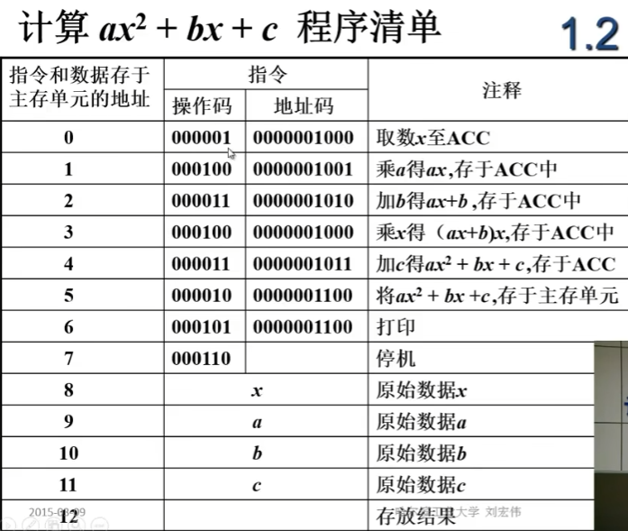  
数据和指令都存储在存储器中，那么主存储器（就是运行内存，辅存是硬盘）结构如何？
>1. 存储器分为存储体、MAR（存储单元地址，反映存储单元个数（因为都是0 1 2编号），用作临时存储的）和MDR（存储器数据，充当临时储存器，位数反映存储字长）  
>2. 存储体（大楼）里面有存储单元（房间）里面有存储元件（床位）（0/1），存储单元存二进制代码。存储单元有存储字（2进制代码的组合），存储字长就是存储字的位数。每个存储单元有个地址，通过地址访问存储字。  

运算器呢,有ACC（累加器） ALU（算术逻辑单元） MQ（乘除寄存器） 和 X（操作数寄存器）？  （MQ是因为乘法会导致位数扩增，所以要个MQ存放乘积低位）
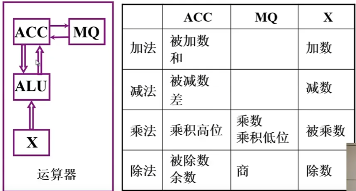  
>1. *图中的哪些数放在哪些寄存器里面，我还是有些疑问，这里归结于指令集的问题*，不同指令集有不同的做法。
>2. 操作数不止一个，可以有多个；`MUL R1, R2, 5  // R1 = R2 * 5, R1和R2是寄存器` 如上 R1 R2 和5 都是操作数，操作数可以是数据也可以是数据的地址。
>3. 乘法计算通过不断移位和加法，除法计算是通过不断的减法（13/5 equal to 13-5-5）  

上面的运算器功能都是在控制器下完成的，控制器应该解释指令，并且保证指令的有序进行。
>控制器完成一条指令：1. 控制器从PC（程序计数器）存的地址取指令存到IR，PC自动更新下一条；2. 分析指令，从指令寄存器（IR）取操作码，进行分析。3. 执行指令。（PC 和IR都属于CU）

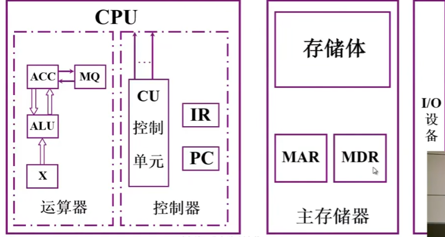  

在上图中取指令是从PC -> MAR -> 存储单元 -> MDR -> IR 最后指令就在IR中了。  
计算机硬件指标有：
1. 机器字长：CPU一次能处理数据的位数，跟寄存器位数相关。越长越好，比如现在都做成64位。
2. 运算速度：主频（决定cpu每s执行的时钟周期数）、核数、 FLOPS（每s浮点运算次数）。
3. 储存容量：主存（运行内存）和辅存（硬盘），b是bit B是byte。1K=2^10。操作系统是给每一个字节分配一个地址，所以32位就代表2^32 个地址，所以是4GB，地址也就是32位了，但实际上可表示的比特位是35位。
# 2. 总线
总线是连接各个部件的信息传输线，各部件共享的传输介质。信息传输分为串行（一位位传也一位位接），并行（需要多条数据线，通常传输距离短，因为多线之间互相影响会导致信号变形）。如果只有一条总线，数据传输效率太低（因为总线上有数据在传，其他模块就不能再用）

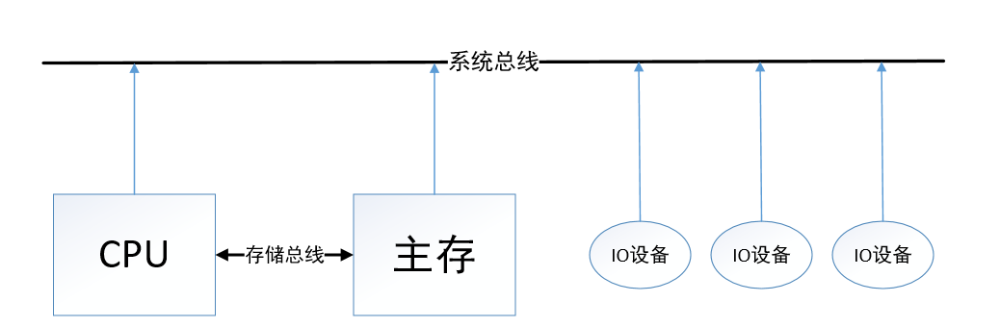  

按照总线位置，总线分为片内总线（芯片内部）和系统总线：数据总线（双向） 地址总线（单向，cpu往外传） 控制总线（双向）和通信总线（计算机系统之间通信）。总线也有类似的性能指标也有设计标准（便于各配件组装成一个电脑）总线结构有很多，比如有局部总线连接CPU和cache，DMA总线连接主存和I/O接口，这里不过多讲述。主要研究一下总线控制（总线一个时候只能有一个设备使用，且怎么通信）。
>1. 总线有主设备（对总线有控制权）和从设备（响应主设备发送的总线命令）。  
>2. 总线集中式：链式查询（一个个按顺序查看谁发送了总线请求） 计数器定时查询（总线控制部件中有计数器，为0就对I/O接口0查看它有没有发送请求，没有就继续增。优点在于优先级灵活确定：由计数器决定） 独立请求方式：每个接口都有独立的接受请求的线（每个接口两条线：BG0-总线同意 BR0-总线请求，总线控制部件中有排队器来确定优先级） 还有总线分布式。  
>3. 总线通信分为同步（共享统一时钟）、异步通信（没有统一时钟）、半同步（有时钟，但是添加个wait信号，主模块检测到了wait信号低电平，从模块才发送数据）、分离式通信（让总线上基本没空闲时刻，主模块和从模块角色可以转换）

# 3. 存储器
存储器为核心的结构。按照存储介质分类： 半导体存储器、磁表面存储器、磁芯存储器、光盘存储器（半导体和磁）。按照存取方式分类：（1）存取时间与物理地址无关:随机存储器和 只读存储器。（2）存取时间与物理地址有关：磁带 和 磁盘（直接存取存储器：去对应磁盘磁道取值）。按照作用分类：（1）主存储器 RAM 和 ROM （2）flash memory（闪存） 类似于u盘（3）高速缓冲存储器（Cache）（4）辅助存储器：磁盘。

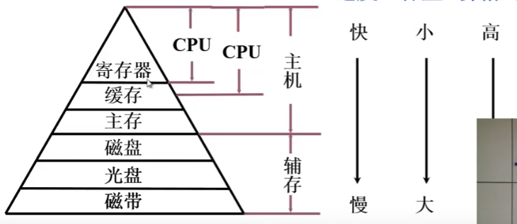 

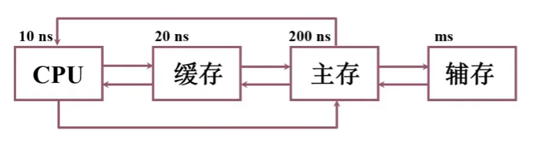 
主存和缓存之间是为了解决速度问题，用硬件来做，主存和辅存之间是为了解决容量问题，用软硬件结合来做。主存储器用到物理地址，主存辅存之间用虚地址（逻辑地址）。（这里有点不太明白....）  

## 1. 主存储器
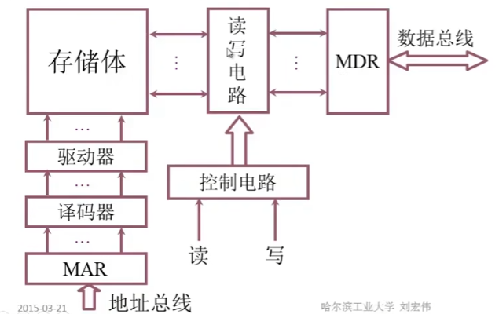 

译码通常指的是CPU的控制单元对指令的操作码进行解析的过程。一般机器中说地址存在字地址和字节地址。通常指针储存的就是字地址。以32位机器为例，一个字就是32位（4字节）。那么假如0x12345678(存在一个存储单元内，也就是一个字)，那么该字的地址是多少。看是大端（12）还是小端（78）。  
主存存储容量指的是主存存放二进制代码的总位数。存储芯片有地址线和数据线，例如14根地址线和 1根数据线，存储芯片就是 16K *1位。
1. 存储芯片的片选线作用,例如想用16K * 1位的存储芯片组成 64K * 4位的存储器。需要32片芯片。在多芯片存储系统中，片选线用于指定当前进行读写操作的存储芯片。当片选信号为低电平时（有些设计可能是高电平），它表明对应的存储芯片被选中。
2. 半导体存储芯片的译码驱动方式：（1）线选法：通过数据线信号确定哪根线。（2）重合法 
3. 存储芯片内是存储矩阵，通过行地址和列地址来选择

### 1. 随机存取存储器（RAM）
RAM 分为静态RAM 和 动态 RAM。一般RAM说的就是系统内存，也就是主存。  
静态RAM采用触发器储存0和1。基本电路就不看了... 动态RAM利用电容存储 0 和 1.充电了就是1，没充电就是0。 读出信息与原存信息相反，所以需要在输出端加个非门。写入与输入信息相同。为什么动态RAM需要刷新：因为电容会放电，所以需要刷新，重新充电，刷新跟行地址有关。主要有异步刷新（分散刷新和集中刷新结合）。主要还是静态RAM好点，贵点。所以通常 主存用 DRAM（动态RAM），缓存（CPU与主存之间）用SRAM（静态RAM）。

### 2. 只读存储器（ROM）
也分为 不可编程类、一次性编程类和多次编程类。比如flash memory（闪存）也是ROM。

### 3. CPU与主存储器的连接
有时要进行存储器容量的扩展，如：
1. 位扩展（增加存储字长）： 1K*4位 扩展到 1K * 8位的。2个芯片片选即可，确保两个芯片同时工作。
2. 字扩展（扩展容量）：1K * 8位 变成 2K * 8位，同样两个芯片。但是两个芯片不同时工作，第一个芯片存满了，再存第二个芯片。
3. 同时扩展： 1K * 4 位 变成 4K * 8 位，8个芯片可以，就是每2个进行片选。然后4 组片选的不同时工作。增加两个线来判断该使用哪一组芯片（00第一组，01第二组... ）

存储器与CPU的连接（主要考虑使用RAM（存用户程序） 和 ROM（存系统程序））：
1. 地址线的连接
2. 数据线的连接
3. 读/写命令线的连接
4. 片选线的连接
   
### 4. 存储器的校验
编码的检测能力与 任意两组合法代码之间二进制位数的最少差异（例如合法代码为00000 11111，那么相差5位，就很能够去纠错）举例说明：
1. 汉明码（具有1位纠错能力）:采用分组奇偶校验。分组是非划分方式，组和组之间有交叉。举例：
例如7位数据，分为3组，每组一个校验位，每组共4个数据位。 
例如： 1 3 5 7 一组 2 3 6 7一组 4 5 6 7 一组，对每一组分别校验，如果 000（p3p2p1） 三组都没问题，如果 001 第一组出错了，就是独有的位置错了（1），如果101，说明 1 3 组都错了，公共部分发生了错误（5），110就是 6， 111 就是 1，**发现位数刚好是三个校验码的十进制表示**。 这样编码下，校验位应该是每组独立的，就是 1 2 4 位（2^n）。那么如何分组呢？例如把 1 3 5 7 二进制化 最后一位都是 1，就是第一组，倒数第二位都是1，就是第二组，依次类推....
汉明码组成需添加多少检测位：假设n数据位，k为分的组，那么`2^k >=n+k+1`,当n=4 时，k=3。检测位取值看采用奇还是偶校验。

    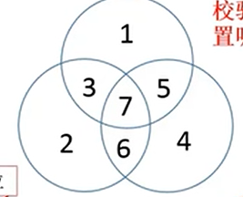 

### 5. 提高访存速度
1. 可以常用信息放cache
2. 调整主存结构：例如CPU为16位，储存器可以设置为64位的，那么一下就能存4个信息。也可以通过多个存储体编号并行，高位作为选择信号，低位作为存储体内部地址。上面两种都存在弊端，使用低位交叉，各个体轮流编址。那么后两位就标志着存储体的位置。这样执行一个程序就会四个存储体一起用起来...
    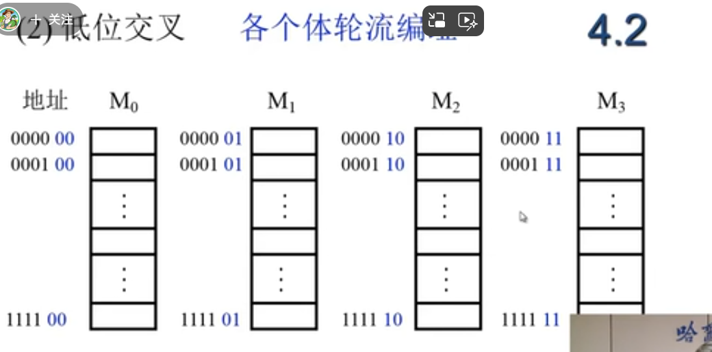 

## 2. 高速缓冲存储器（Cache）
cache主要是因为存储器访存速度较于cpu速度慢问题，解决cpu空等问题。所以在cpu和主存之间添加个缓存。程序访问的局部性原理有两种：时间局部性：当前使用的指令不久之后还会使用到。空间局部性：当前使用的指令后面的指令也有可能使用到。所以都会放到cache之中。cache与主存交换的大小是 一块块，块的大小需要通过实验得到。

### 1. cache工作原理

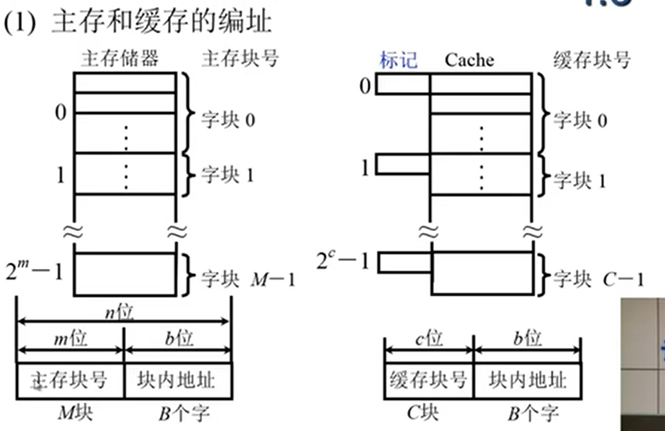 

都是通过块号和块内偏移量来编址的。cache前面有个标记，是跟主存的标记对应的（例如 主存标记a移到cache，cache标记也为a）。cache主存之间 按块存储，块大小相同。  
上图可知 缓存C块，主存M块，M>>C。命中就是主存调入缓存，主存块与缓存块建立了对应关系。未命中则相反。我们当然希望都能命中，用Cache命中率来评价：命中率与Cache容量与块长有关。块长取一个存取周期内从主存调出的信息长度。cache-主存系统的效率 e = 访问cache的时间/平均访问时间，设命中率为h，访问cache的时间为tc，访问主存的时间为tm，则：
$$ e = \frac{t_c}{h*t_c+(1-h)*t_m} $$
可以看出cpu是并行访问 cache 和 主存的。  
cache基本结构如下：

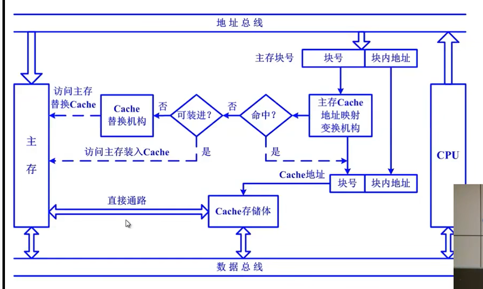 

从图中可以看出，如果未命中是先把主存数据送入cache，然后访问。cache的读操作时，如果未命中既要访问主存，把信息送CPU，同时也要将其送入Cache（如果Cache满了，需要执行替换算法腾出空位）。Cache的写操作时，要保证Cache和主存的一致性，分为两种：
1. 写直达法：写操作数据时，既写入Cache又写入主存，写操作时间就是访问主存的时间。
2. 写回法：写操作时只写入Cache，Cache数据被替换出去后才写入主存。

对Cache的改进措施：
1. 增加Cache级数
2. 分为指令Cache和数据Cache。分立缓存

### 2. Cache-主存的地址映射
前面讲到，把主存块存到Cache中，要经过地址映射变换结构（就是看Cache里面哪些块可以存）
1. 直接映射：就是每个主存块只能对应一个缓存块，每个缓存块可以对应若干主存块。

   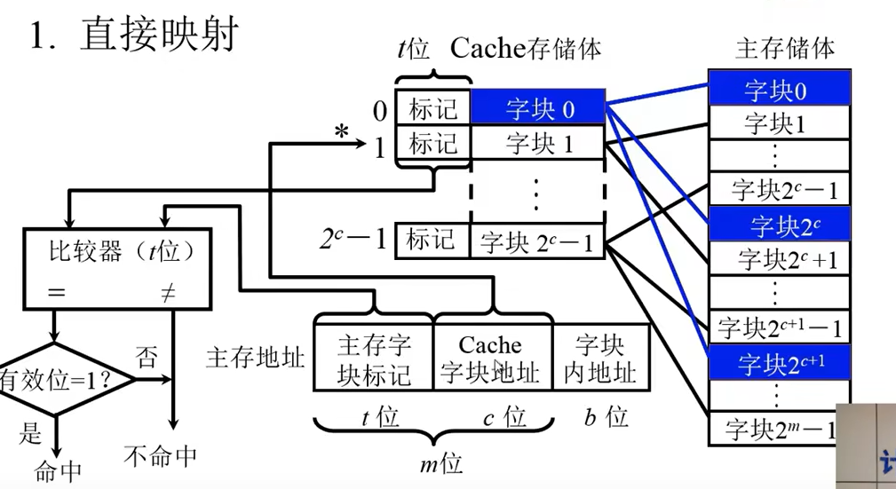 
   
   这样cache的利用率会比较低。

2. 全相联映射。
随便放，但是存在问题，就是给个主存地址，如果放入了缓存，主存块标记就要跟缓存块标记逐一比较，看是哪个块。这个速度比较慢。
3. 组相联映射
结合上面两种优点，将Cache分组，Q为组数。

   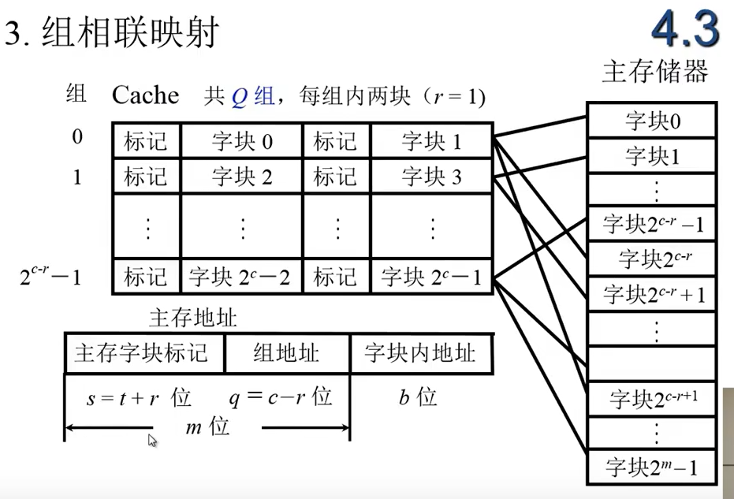 

就是某一主存块j，按模Q映射到缓存的第i组的**任一一块**。  

### 3. 替换算法
就是替换Cache数据的时候。可以先进先出。或者LRU（近期最少使用算法）

## 3. 辅助存储器
不直接与cpu交换信息。有磁盘存储器（固态硬盘、机械硬盘等）。

# 4.输入输出系统
早期是分散连接，cpu和I/O设备串行工作，每一个设备都有专门的电路。接着发展到了接口模块和DMA阶段，用总线连接I/O设备。**CPU和I/O设备并行工作：中断方式和DMA方式**。 
I/O系统有软硬件。
1. 软件：cpu执行I/O指令，操作码+命令码+设备码（操作码标志这样的操作是I/O操作，命令码标志是什么操作，设备码标志操作哪个设备）。通道指令：通道是一种特殊类型的进程或线程，用于管理数据传输，特别是在输入/输出操作中。需要指出数组首地址、传送字数和操作命令。
2. 硬件：如果是I/O指令，就是IO设备通过接口连接到总线。 或者 设备通过设备管理器连接到子通道，子通道再连接到通道。
   
   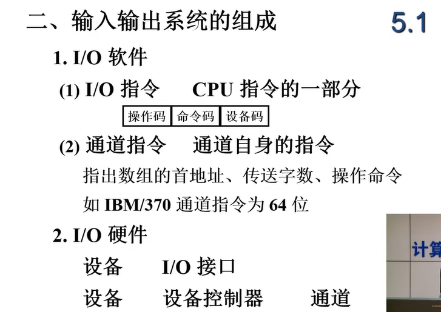 

I/O设备与主机的联系方式：
1. I/O设备需要编址。统一编址：I/O设备与内存一起编址。不统一编址，需要有单独的I/O指令。用设备选择电路识别I/O设备是否被选择。
2. 数据传输：串行和并行
3. I/O设备对于指令的反馈：（1）立即响应（2）I/O接口跟I/O设备采用异步应答信号或是串行 或是 同步工作（采用统一时钟）

I/O设备与主机的连接方式：分散式连接和总线连接。  
I/O设备与主机信息传输的控制方式（I/O设备要先准备自己信息，然后再传送）：
1. 程序查询方式：CPU通过I/O指令询问指定外设当前的状态，如果外设准备就绪，则进行数据的输入或输出，否则CPU等待，循环查询。这种方式的优点是结构简单，缺点是由于CPU的速度远远高于外设，因此通常处于等待状态，工作效率很低
2. 程序中断方式：CPU不再被动等待，而是可以执行其他程序，一旦外设为数据交换准备就绪，可以向CPU提出服务请求，CPU如果响应该请求，便暂时停止当前程序的执行，转去执行与该请求对应的服务程序，完成后，再继续执行原来被中断的程序。这种方式的优点是提高了CPU的工作效率，满足了外设的实时要求，但**需要为每个I/O设备分配一个中断请求号和相应的中断服务程序**
3. 直接存储器访问方式（DMA）:采用一个专门的控制器来控制内存与外设之间的数据交流，**无需通过CPU**。在进行DMA数据传送之前，DMA控制器会向CPU申请总线控制权，CPU如果允许，则将控制权交出，在数据交换时，总线控制权由DMA控制器掌握，在传输结束后，DMA控制器将总线控制权交还给CPU。总线被DMA占用的时候，CPU不能访问内存。

## 1. I/O设备
外部设备进行简介。主要分为三大类：人机交互设备（键盘鼠标打印机显示器）、计算机信息存储设备（磁盘、光盘）、机-机通信设备。举例输入设备：
1. 键盘： 按键，判断哪个键按下，将此键翻译成ASCII码
2. 鼠标
3. 触摸屏

输出设备：显示器 打印机
## 2. I/O接口
I/O设备通过I/O接口连接在总线上。接口作用如下：

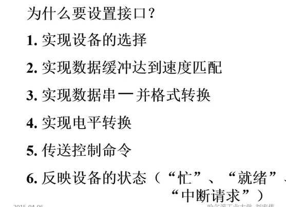 
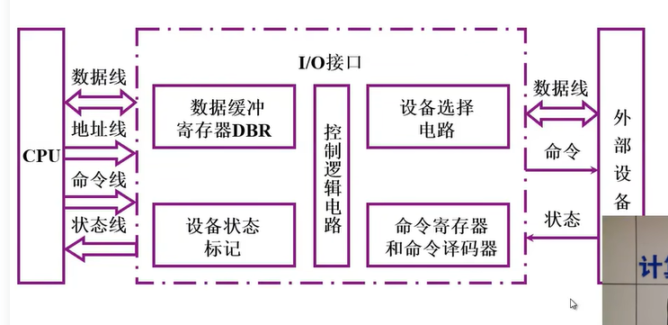 

## 3. 程序查询方式
流程前面已经介绍，设置计数器，每传输一个值，计数器就+1。以输入为例，电路图如下：

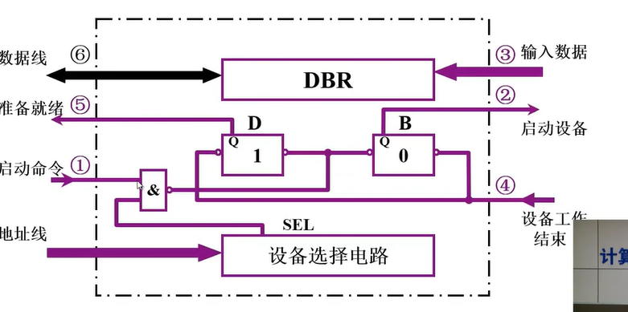

## 4. 程序中断方式
